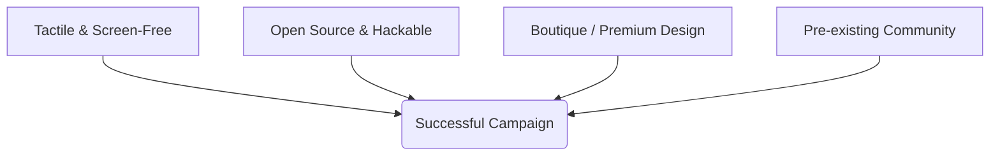

# Market Analysis & Kickstarter Blueprint: Music Hardware (Synths, MIDI, Pedals)

This analysis evaluates the current market landscape for synthesizers, MIDI controllers, and guitar pedals, focusing on the intersection of **open-source hardware (OSHW)** and **crowdfunding success**. It outlines what makes hardware projects successful on Kickstarter and presents four product concepts designed for crowdfunding campaigns.

---

## 1. Market Landscape & Crowdfunding Success Factors

Crowdfunding platforms (specifically Kickstarter and Indiegogo) have democratized music technology by allowing boutique developers to bypass traditional venture capital and retail channels. Successful campaigns in this space tend to succeed based on **aesthetic appeal, community ownership, and structural hackability**.

### Key Trends & Case Studies



1. **CHOMPI Sampler (2023 - $1M+ raised):**
   * **The Hook:** A chromatic sampler/looper designed with a "cute" (kawaii) aesthetic, mechanical keyboard keys, and a completely screenless workflow.
   * **Technology:** Built entirely on the open-source **Electro-Smith Daisy Seed** DSP platform.
   * **Why it worked:** It combined highly professional DSP code with a playful, accessible interface that stood out in a sea of sterile black and grey music gear.

2. **Tembo (2026 - $2.0M+ raised):**
   * **The Hook:** A screen-free, grid-based hardware sequencer using physical magnetic chips to trigger steps and modulation.
   * **Why it worked:** Heavy focus on tactile and physical interactions. In an era of screen fatigue, musicians crave hardware that feels physical and interactive.

3. **OnePedal (2026 - $200k+ raised):**
   * **The Hook:** An AI-powered guitar pedal capable of capturing and recreating the tone of any amplifier or pedal using a mobile app.
   * **Technology:** Neural network DSP.
   * **Why it worked:** Tackled a huge trend (neural profiling) and condensed it into an accessible, single-enclosure stompmbox format.

4. **Timepod (2025 - $73k raised):**
   * **The Hook:** A dedicated MIDI controller with 16 high-resolution endless encoders and a firmware-level preset-snapshot system.
   * **Why it worked:** It solved a specific workflow problem for DAW users who want high-quality tactile control without complex mapping interfaces.

---

## 2. Existing Open Source Hardware Platforms

Leveraging existing open-source hardware frameworks reduces development time, guarantees class-compliance, and allows campaigns to offer both **pre-built units** and **DIY kits** to attract multiple tiers of backers.

| Platform | Core Processor | Best Suited For | Key Open Source Ecosystem |
| :--- | :--- | :--- | :--- |
| **Electro-Smith Daisy Seed** | ARM Cortex-M7 (480MHz) | Guitar pedals, Eurorack modules, mono/poly desktop synths. | PedalPCB Terrarium, GuitarML, Synthux Academy |
| **PJRC Teensy 4.1** | ARM Cortex-M7 (600MHz) | Handheld sequencers, polyphonic synths, dense MIDI controllers. | Teensy Audio Library, Dirtywave M8 Headless |
| **Raspberry Pi (Zero 2W / CM4 / CM5)** | Quad-core ARM Cortex | Multipurpose workstations, touchscreens, Linux host synths. | Zynthian, Monome Norns Shield, MiniDexed |
| **Raspberry Pi RP2040 / Pico** | Dual ARM Cortex-M0+ | MIDI controllers, capacitive touch interfaces, simple DSP. | OpenDeck, Control Surface Library |

---

## 3. Product Opportunities for Kickstarter

The following four concepts leverage open-source foundations, target current market gaps, and are optimized for the Kickstarter demographic.

---

### Concept 1: The "Voxel" — Pocket Chromatic Looper & Mechanical Groovebox
*A screenless, ultra-tactile sampler and tape-style sequencer built on mechanical keyboard switches.*

```
+------------------------------------------+
|  [ VOL ]  [ PITCH ]  [ SPEED ]  [ FX ]   |  <-- Custom Machined Knobs
|                                          |
|   (REC)   (PLAY)   (STOP)   (TAPE SPEED)  |  <-- Arcade-style buttons
|                                          |
|   [ ] [ ] [ ] [ ] [ ] [ ] [ ] [ ] [ ]    |  <-- Mechanical Key Switch Keyboard
|   [ ] [ ] [ ] [ ] [ ] [ ] [ ] [ ] [ ]    |      (BOBO-style keycaps)
+------------------------------------------+
```

* **Target Audience:** Synth enthusiasts, portable music makers, lo-fi musicians, and the "desk setup" aesthetics community.
* **Technical Foundation:** 
  * **DSP:** Electro-Smith Daisy Seed (handles stereo sampling, pitch-shifting, and tape saturation effects).
  * **Controls:** 16-24 mechanical keyboard switches (Cherry MX hot-swappable) with a chromatic layout.
  * **Storage:** MicroSD card slot for sample import/export.
* **Why it's a Kickstarter Success:** 
  * Establishes a highly distinct aesthetic (like CHOMPI or Teenage Engineering).
  * Screen-free interface lowers build complexity while increasing the "fun" factor.
  * High margins due to Daisy Seed's low cost relative to its performance.

---

### Concept 2: The "Kore DSP" — Neural Guitar Amp & FX Profiler
*A boutique, dual-footswitch guitar pedal running open-source neural networks for amp/pedal modeling.*

```
+------------------------------------------+
|     Gain      Treble     Bass      Vol   |  <-- Metal Knobs
|     ( )        ( )       ( )       ( )   |
|                                          |
|               [ OLED DISPLAY ]           |  <-- Mini status/preset screen
|                                          |
|      [BYPASS]             [PRESET/ALT]   |  <-- Heavy duty footswitches
|        (O)                    (O)        |
+------------------------------------------+
```

* **Target Audience:** Guitarists, bassists, and home studio producers looking for an affordable, open-source alternative to Quad Cortex or Kemper.
* **Technical Foundation:**
  * **DSP:** Electro-Smith Daisy Seed or custom STM32H7 board running the open-source **RTNeural** engine.
  * **Enclosure:** Machined aluminum (125B size) with standard 1/4" stereo jacks and MIDI In/Out (TRS Type A).
  * **Software Integration:** WebUSB-based utility that lets users drag and drop pre-trained `.nam` (Neural Amp Modeler) or `GuitarML` model files directly into the pedal via their browser.
* **Why it's a Kickstarter Success:**
  * Guitar players love boutique pedals, especially those offering high-end features (neural modeling) at a fraction of the cost ($249-$299 Kickstarter price point vs. $1,000+ for commercial units).
  * Fully OSHW-compatible, enabling a vibrant DIY community that creates and shares custom DSP models.

---

### Concept 3: The "Ortho MPE" — Tactile Grid & Poly-Touch Controller
*An ergonomic mechanical keyboard MIDI controller with individual key polyphonic aftertouch and expression strips.*

```
+------------------------------------------------+
|  [Haptic Strip 1]   [Haptic Strip 2]   [OLED]  |
|                                                |
|  [x][x][x][x][x][x][x][x][x][x][x][x][x][x][x] |  <-- Ortholinear mechanical grid
|  [x][x][x][x][x][x][x][x][x][x][x][x][x][x][x] |      with polyphonic pressure
|  [x][x][x][x][x][x][x][x][x][x][x][x][x][x][x] |      sensitivity (MPE)
+------------------------------------------------+
```

* **Target Audience:** Electronic producers, modular synth players, and keyboardists seeking expressive MPE control.
* **Technical Foundation:**
  * **MCU:** PJRC Teensy 4.1 or dual RP2040 microcontrollers.
  * **Sensors:** Polyurethane/conductive rubber matrix under mechanical switches to measure dynamic key pressure (aftertouch).
  * **I/O:** USB-C (class-compliant MIDI), Bluetooth LE MIDI (ESP32-based co-processor), and physical TRS MIDI Out.
* **Why it's a Kickstarter Success:**
  * The MPE market is growing fast, but options are either expensive (Roli, Osmose) or flat silicon sheets (Erae Touch, Sensel Morph).
  * A mechanical keyboard that doubles as a highly expressive layout appeals to both the keyboard-building community and music producers.

---

### Concept 4: The "Wavetable Skiff" — Desktop / Eurorack Hybrid Synth
*A patchable desktop synthesizer that can be unscrewed from its wooden case and mounted directly into a Eurorack modular case.*

```
+------------------------------------------------+
|  (CV In) (CV In) (Gate) (Output)      [OLED]   |  <-- 3.5mm Eurorack jacks
|                                                |
|   Waveform     Cutoff     Resonance    Depth   |  <-- Potentiometers
|     ( )         ( )          ( )        ( )    |
|                                                |
|   [ ] [ ] [ ] [ ] [ ] [ ] [ ] [ ] [ ] [ ] [ ]  |  <-- Touchplate keyboard (capacitive)
+------------------------------------------------+
```

* **Target Audience:** Eurorack modular enthusiasts and desktop synth collectors.
* **Technical Foundation:**
  * **DSP/Control:** Daisy Seed.
  * **Interface:** 12 HP Eurorack front panel. When mounted in the desktop skiff, it connects to a passive baseboard breaking out USB-C power, stereo 1/4" outputs, and MIDI TRS.
  * **Engine:** Built-in multi-engine (wavetable, physical modeling, FM) using open-source algorithms.
* **Why it's a Kickstarter Success:**
  * Bridges the gap between standalone desktop synthesizers and modular synths.
  * The "skiff-friendly Eurorack module + desktop unit in one" is a highly marketable product structure.

---

## 4. Crowdfunding Execution Roadmap

If you decide to move forward with one of these projects, use the following operational roadmap to prepare the campaign:

```
[Month 1-3: Prototyping] ---> [Month 4-5: Community & List Building] ---> [Month 6: Campaign Launch] ---> [Month 7-12: Manufacturing & Shipping]
```

### Stage 1: Design & Validate (Months 1–3)
1. **BOM Optimization:** Use readily available parts. The Daisy Seed or Teensy 4.1 should act as the brain to minimize layout design risks.
2. **Industrial Design:** Use high-quality render models and 3D print cases to test physical ergonomics.
3. **Firmware Proof of Concept:** Write the basic audio engine and ensure latency is sub-10ms.

### Stage 2: Pre-Launch Marketing (Months 4–5)
1. **Build a Landing Page:** Collect email addresses by promising early-bird discounts.
2. **Community Infiltration:** Post build logs on **r/synthdiy**, the **Elektronauts** forum, **Mod Wiggler**, and **PedalPCB forums**. Show working prototypes, not just mockups.
3. **Send Prototypes to Influencers:** Build 5–10 beta units and send them to niche YouTubers (e.g., *Loopop*, *Cuckoo*, *Benn Jordan*, or *Knobs* for pedals) to ensure day-one video coverage.

### Stage 3: Campaign Launch (Month 6)
* Set a realistic funding goal that covers the minimum order quantity (MOQ) for PCBs and custom enclosures (typically $20,000–$30,000).
* Offer a **DIY Kit Tier** (PCB + pre-programmed chip) alongside the **Assembled Retail Tier** to lower the entry price point.

### Stage 4: Production & Fulfillment (Months 7–12)
* Partner with a turn-key manufacturer (like PCBA houses in Shenzhen or local assembly houses) to avoid manual soldering of thousands of units.
* Maintain bi-weekly, transparent updates on Kickstarter, sharing both manufacturing wins and unforeseen bottlenecks.
