# Product Specification: Voxel Stomp

**Voxel Stomp** is a hybrid guitar pedal and desktop performance instrument that combines state-of-the-art **Neural Amp Modeling (NAM)** with an expressive **sound-on-sound tape looper**. Designed in a premium wedge-shaped enclosure with solid wood cheeks, it features two heavy-duty footswitches for hands-free play and a 1-octave mechanical key layout on the face for desktop sound manipulation.

---

## 1. System Architecture

Voxel Stomp utilizes a **Dual-MCU Architecture** to guarantee zero-latency audio performance and glitch-free UI updates.

*   **Daisy Seed (STM32H753):** Dedicated exclusively to high-fidelity audio DSP, running the RTNeural engine and the looper audio buffers.
*   **RP2040:** Dedicated to UI tasks, including mechanical key scanning, OLED screen rendering, LED animations, and serial communication.

### Block Diagram

```mermaid
graph TD
    %% Inputs
    AudioIn["Guitar/Line Input (1/4'' Stereo)"] --> Codec["Daisy Onboard Codec (24-bit/96kHz)"]
    Power["Dual Power Input (9V DC / USB-C)"] --> PowerSupply["Power Management (Isolated 5V / 3.3V)"]
    
    %% Daisy Seed Audio DSP
    subgraph DaisySeed["Daisy Seed (DSP Engine)"]
        Codec <--> STM32H7["STM32H7 Processor (480MHz)"]
        SDCard["MicroSD Card (Profiles/Loops)"] <--> STM32H7
        RTNeural["RTNeural Amp Engine"] <--> STM32H7
        Looper["Tape Looper Buffer (SRAM/SDRAM)"] <--> STM32H7
    end
    
    %% RP2040 UI Controller
    subgraph RP2040_Sub["RP2040 (UI Controller)"]
        RP2040_MCU["RP2040 Chip"]
        Keys["13 Mechanical Keys (Grid Matrix)"] --> RP2040_MCU
        Footswitches["2 Heavy Duty Footswitches"] --> RP2040_MCU
        Pots["4 Parameter Pots & 1 Encoder"] --> RP2040_MCU
        OLED["128x64 OLED Display"] <-- SPI/I2C --> RP2040_MCU
        LEDs["RGB Key Backlighting (WS2812B)"] --> RP2040_MCU
    end
    
    %% Inter-MCU Communication
    RP2040_MCU <--> |"UART (MIDI / Custom Packets)"| STM32H7
    
    %% Outputs
    STM32H7 --> Codec
    Codec --> AudioOut["Audio Output (1/4'' Stereo)"]
    
    %% External Connections
    USB["USB-C Port (WebUSB / WebMIDI / Power)"] <--> RP2040_MCU
    MIDI["MIDI TRS In/Out (Type A)"] <--> RP2040_MCU
```



---

## 2. Hardware Specification & BOM Target

To hit a target Kickstarter price of **$299** (with a **$399** retail price), the Bill of Materials (BOM) is budgeted at **$75.00** at production scale (1,000+ units).

| Component | Description | Est. Cost (Qty 1k) |
| :--- | :--- | :--- |
| **Daisy Seed** | STM32H753 system-on-module (ARM Cortex-M7 @ 480MHz, 64MB SDRAM, 8MB Flash). | $24.00 |
| **RP2040 Subsystem** | RP2040 chip, external flash, oscillator, and support circuitry. | $3.50 |
| **Audio I/O & Codec** | Low-noise op-amp input buffers, stereo jacks, and ESD protection. | $6.00 |
| **Enclosure** | Machined & sandblasted wedge-shaped aluminum shell with solid walnut end-cheeks. | $15.00 |
| **Mechanical Keys** | 13 Hot-Swappable Cherry MX-style switches and custom dye-sub PBT keycaps. | $8.00 |
| **User Interface** | 4 potentiometers, 1 rotary encoder, 128x64 white OLED screen, WS2812B LEDs. | $6.50 |
| **Power Management** | High-efficiency DC-DC step-down converters, 9V reverse polarity protection, and isolation. | $4.00 |
| **Packaging & Accessories** | Custom retail box, premium USB-C braided cable, and quick-start card. | $8.00 |
| **Total Target BOM** | | **$75.00** |

---

## 3. Software Architecture

### Daisy Seed (Audio DSP)
*   **Operating System:** Bare-metal C++ compiled with standard optimization flags.
*   **Neural Simulation:** **RTNeural** framework running optimized GRU (Gated Recurrent Unit) or LSTM (Long Short-Term Memory) models trained using the Neural Amp Modeler pipeline. It runs in a high-priority interrupt loop.
*   **Tape Looper Engine:**
    *   32-bit float circular delay line stored in Daisy's external 64MB SDRAM (supports over 5 minutes of high-resolution stereo loops).
    *   Linear interpolation for smooth pitch/speed changes without crackling.
    *   Virtual "tape heads" that can write at different speeds and direction vectors to create sound-on-sound overdub layers.
    *   Granular reverse playback windowed with cosine-envelope fades to prevent clicks.

### RP2040 (UI & System Control)
*   **Firmware:** Written in C/C++ using the Raspberry Pi Pico SDK.
*   **Key Matrix Scanning:** Low-latency key-matrix scanning with software debouncing.
*   **OLED Rendering:** Custom lightweight graphics library to display waveform, selected amp model name, looper state, and parameter values.
*   **UART Protocol:** Sends MIDI messages (PC for preset changes, CC for parameter changes) and system-exclusive packets to the Daisy Seed to sync states.

### Web Interface
*   **Technology:** HTML5, CSS, and WebUSB/WebMIDI APIs (runs entirely in standard browsers like Chrome or Edge without software installation).
*   **Functionality:**
    1.  **NAM Profile Loader:** Drag-and-drop `.nam` or `.json` models. The browser converts and structures the model to fit Voxel Stomp's format and uploads it over USB-C.
    2.  **Loop Manager:** Allows backers to back up loops recorded on the device or preload custom backing tracks onto the MicroSD card.
    3.  **Firmware Updates:** Updates both the RP2040 and Daisy Seed firmware over the web.

---

## 4. Physical Control & Layout Design

```
                     +---------------------------------------+
                     |  [GAIN]   [BASS]   [TREBLE]   [VOL]   |  <-- Potentiometers
                     |                                       |
                     |             [ OLED SCREEN ]           |  <-- Display
                     |                                       |
                     |  [1] [2] [3] [4] [5] [6] [7] [8] [9]  |  <-- 13 Mechanical Keys
                     |  [10]  [11]  [12]  [13]  [14]  [15]   |      (1-Octave Chromatic + Control)
                     |                                       |
                     |    [BYPASS]             [TAP/REC]     |  <-- Heavy-Duty Footswitches
                     +---------------------------------------+
```

### Keyboard Layout Mapping
*   **Keys 1-7 (White Keys):** Speed & Direction steps:
    *   `Key 1`: 1/4 Speed (Slow-mo wash)
    *   `Key 2`: 1/2 Speed (Low octave)
    *   `Key 3`: Normal Speed (Forward)
    *   `Key 4`: Double Speed (High octave)
    *   `Key 5`: Reverse 1/2 Speed
    *   `Key 6`: Reverse Normal Speed
    *   `Key 7`: Reverse Double Speed
*   **Keys 8-10 (Black Keys):** Performance FX:
    *   `Key 8`: Tape Stop (Simulates vinyl friction slowdown)
    *   `Key 9`: Granular Freeze (Loops a micro-buffer indefinitely)
    *   `Key 10`: Stutter/Retrigger (Instantly repeats the last 1/16th note)
*   **Keys 11-13 (Auxiliary Keys):** System & Utility:
    *   `Key 11`: Record / Overdub
    *   `Key 12`: Play / Stop
    *   `Key 13`: Clear / Erase Loop
