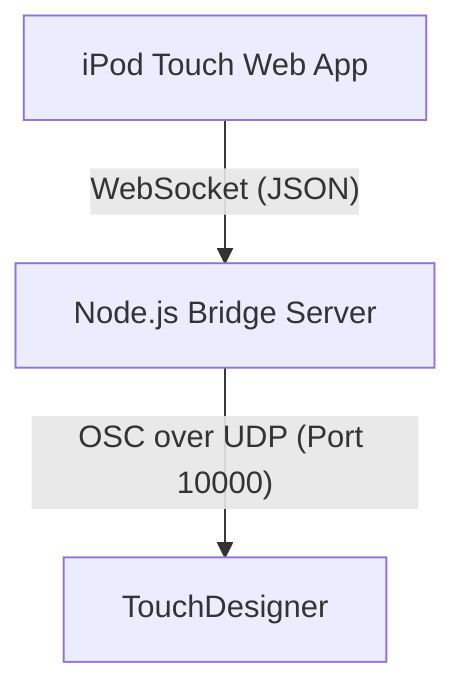

# Implementation Plan: iPod Touch to TouchDesigner MIDI/OSC Touch Pad

This project enables a 32-bit legacy iPod touch (running iOS 9 or earlier) to act as a MIDI/OSC touch controller for TouchDesigner.

Since browsers cannot open UDP ports to send raw OSC messages directly, the system uses a local Node.js bridge server running on the host PC (where TouchDesigner runs). The iPod touch connects to the host PC's IP address, loads a lightweight web app, and sends touch events via WebSockets. The bridge server translates these WebSockets events into OSC UDP packets and forwards them to TouchDesigner.

## User Review Required

> [!IMPORTANT]
> Since the iPod Touch runs an older version of Safari (iOS 9 or earlier), the web app must avoid modern JavaScript features (like classes, ES modules, or arrow functions) and modern CSS features (like CSS Grid or advanced nesting) that might cause crashes or styling breaks on the device.
>
> You will need to run the Node.js server on the same network as the iPod touch, and configure TouchDesigner's **OSC In CHOP** to listen on port `10000`.

## Proposed Changes

We will create a directory `[local path redacted]` with the following structure:

### Backend (Node.js Bridge)

#### [NEW] [server.js](file://[local path redacted])
A lightweight Node.js server using:
- `ws` for WebSocket communication.
- `node-osc` (or a simple custom OSC buffer writer to avoid native compilation issues on old systems) to send UDP OSC packets.
- `express` or built-in `http` to serve the static client files.

#### [NEW] [package.json](file://[local path redacted])
Standard Node.js project manifest.

### Frontend (iPod Web App)

#### [NEW] [public/index.html](file://[local path redacted])
A responsive HTML layout optimized for the iPod Touch screen aspect ratio. It features:
- A 4x4 velocity/touch-sensitive pad grid.
- Pitch/Modulation vertical sliders.
- A custom X/Y touch pad.

#### [NEW] [public/style.css](file://[local path redacted])
Sleek dark-mode interface with a glowing aesthetic (glassmorphic styling, vibrant color indicators) compatible with legacy Safari engines.

#### [NEW] [public/app.js](file://[local path redacted])
ES5-compatible client-side logic utilizing touch events (`touchstart`, `touchmove`, `touchend`) to prevent lags and capture touch velocities (via touch pressure or rate of displacement/area where supported).

---

## Verification Plan

### Automated Tests
We will verify:
- Server startup and network binding.
- WebSocket message parsing.
- OSC packet structure and dispatch.

### Manual Verification
1. Start the server and note the local IP address printed on screen.
2. Load the page on the iPod touch.
3. Observe console logs or run an OSC monitor (like Protocol or TouchDesigner's Dialogs -> OSC In Monitor) to verify OSC receipt.
