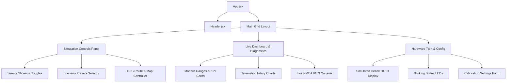

# Implementation Plan: Interactive Simulator & Testbed for BYO Sim Boat Monitor (BilgeGuard)

This plan outlines the architecture and implementation steps to build a high-fidelity, premium interactive testing application for the **BYO Sim Boat Monitor**. This dashboard will act as a "digital twin" of the ESP32-based hardware (BilgeGuard/LoRa Boat Monitor), allowing developers and users to simulate sensor inputs, trigger alarm scenarios, visualize telemetry on interactive gauges/maps, calibrate sensors, and inspect raw NMEA/LoRa/Ubidots payloads.

## User Review Required

> [!IMPORTANT]
> The application will be built as a standalone **React + Vite** SPA in `[local path redacted]`. 
> Since there is no active workspace, we recommend configuring `[local path redacted]` as the active workspace after initialization.

> [!TIP]
> The application is styled using **Vanilla CSS (or styled-components / CSS variables)** with custom animations, glassmorphism card panels, and interactive elements to provide a state-of-the-art developer and testing experience.

---

## Open Questions
*No open questions at this stage. The requirements are fully mapped based on the existing C++ code and hardware specifications.*

---

## Proposed Changes

We will create a new React + Vite project in the scratch directory. The codebase will consist of the following structure:

### Component Architecture

### New Project Structure

#### [NEW] [index.html](file://[local path redacted])
The HTML entrypoint, configured to load the React app and load premium typography (`Outfit` and `JetBrains Mono` from Google Fonts).

#### [NEW] [src/index.css](file://[local path redacted])
The core design system containing custom CSS tokens, modern styling (glassmorphism backdrops, glow effects, custom scrollbars, layout helpers), and animations.

#### [NEW] [src/App.jsx](file://[local path redacted])
The main controller. Holds state for all simulated hardware parameters:
- **Battery**: raw ADC voltage, calibrated voltage, battery capacity.
- **Float Switch**: bilge state (Normal/Alarm), run counter.
- **Tanks 1 & 2**: raw resistance (ohms), analog voltage, calculated percentage.
- **Temperatures**: DS18B20 (Engine, Fridge, Battery), BME280 (Cabin Temp, Dewpoint).
- **Environment**: Humidity, Pressure.
- **GPS**: Lat, Lon, Alt, Speed, Course, Satellite lock, simulated route step.
- **Victron**: Panel voltage, battery current, temp, charge state.
- **Relay**: Active state, timer countdown.
- **Calibration Settings**: `a1vslope`, `a2vslope`, `voffset`, `t1offset`, `a1t1slope`, `a2t1slope`, `t2offset`, `a1t2slope`, `a2t2slope`.

#### [NEW] [src/components/SimulationControls.jsx](file://[local path redacted])
Contains input controls:
- **Sliders & Toggles**: Interactive inputs for all parameters.
- **Scenario Presets**:
  - `Normal Anchored`: Calm weather, stable 12.6V, bilge inactive.
  - `Engine Running / Charging`: Engine temp 82°C, battery voltage 14.1V, alternator charge indicator.
  - `Severe Storm / Leak`: Low barometric pressure (980mbar), 99% humidity, bilge alarm active (triggering blinking sirens).
  - `Solar Charging`: Victron active (18V solar, 5.2A current, 88% SoC).
  - `Sailing Trip`: Toggles GPS auto-navigation, which moves the boat along a simulated path, generating speed/bearing changes.
- **Interactive Map**: A lightweight visual map widget showing the boat moving.

#### [NEW] [src/components/OLEDDisplay.jsx](file://[local path redacted])
A pixel-perfect simulation of the Heltec WiFi LoRa 32 V2 OLED display. It renders the device's diagnostic screens:
- **Booting Screen**: Animation of ESP32 boot, sensor initialization, and network join.
- **Live Diagnostics Screen**: Renders text values (e.g., `V: 12.82V`, `T1: 45%`, `B: OK`, `T: 22.4C`, `GPS: Fix`) matching the layout generated by the C++ firmware.
- **Transmission Frame**: Periodically blinks "LoRa TX..." or "LTE-M Join..." when sending data.

#### [NEW] [src/components/TelemetryGauges.jsx](file://[local path redacted])
Renders modern, premium KPI cards and gauges:
- **Battery Gauge**: Radial ring changing color from green to orange/red as battery drains.
- **Bilge Guard Status**: An urgent visual indicator that flashes red during a bilge alarm.
- **Water & Fuel Tanks**: Dynamic liquid-fill meters.
- **Solar Charge Monitor**: Renders a clean charging card displaying Victron VE.Direct data.

#### [NEW] [src/components/NMEADiagnostics.jsx](file://[local path redacted])
Displays:
- **NMEA 0183 Output**: Real-time generation and display of standard marine strings:
  - `$GPRMC` (Position, Speed, Course, Time)
  - `$WIMDA` (Meteorological data: temp, pressure, humidity)
  - `$GPZDA` (UTC Date/Time)
- **JSON Telemetry Payload**: A toggle to show the raw JSON payload produced by `/json` that matches the ESP32 server output format.

---

## Verification Plan

### Automated Tests
- Validate that the code compiles successfully under Vite (`npm run build`).

### Manual Verification
- We will launch the Vite development server using `npm run dev`.
- Using a browser subagent, we will navigate to the simulator and verify:
  1. Setting the battery voltage slider to `< 11.0V` triggers a "Low Battery" warning card and changes the OLED status.
  2. Activating the Bilge Switch toggle triggers a flashing red alarm state and flashes the simulated physical alarm LED.
  3. Clicking the `Sailing Trip` scenario auto-generates shifting latitude/longitude coordinates and outputs live NMEA `$GPRMC` sentences.
  4. Updating calibration settings recalculates tank percentage display correctly.
