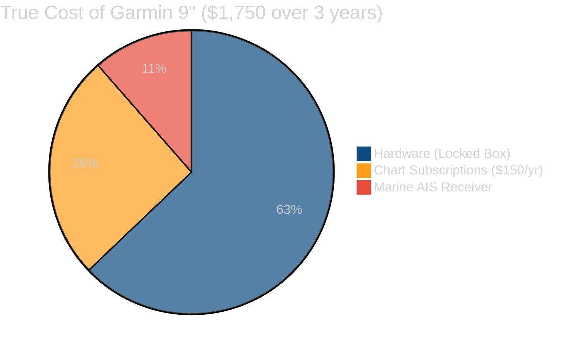
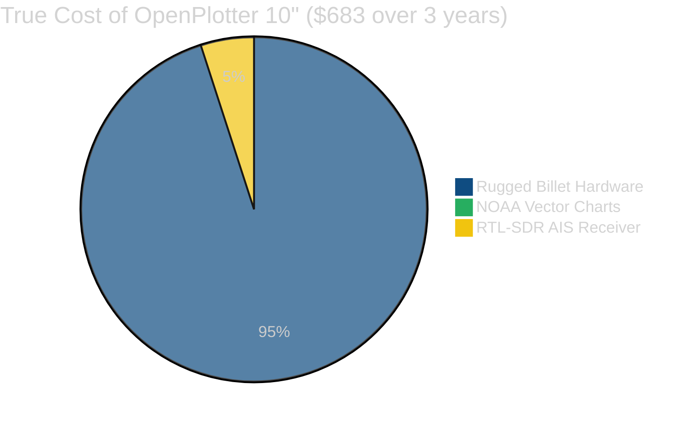

# Total Cost of Ownership: OpenPlotter vs. Commercial Brands

When you buy a commercial marine chartplotter, the hardware price is just the down payment. Here is the true 3-year Total Cost of Ownership (TCO) breakdown comparing OpenPlotter to the industry-leading Garmin units.

## 3-Year Cost Breakdown Table

| Device | Screen Size | Initial Hardware Cost | Chart Subscription (3 Yrs) | AIS Receiver Module | **True 3-Year Cost** |
| :--- | :---: | :---: | :---: | :---: | :---: |
| **OpenPlotter Premium** | 7" Touch | **$299** | **$0** (Free NOAA) | **$34** (RTL-SDR) | <mark>**$333**</mark> |
| **Garmin ECHOMAP UHD2** | 5" Non-Touch| $400 | $450 ($150/yr Navionics+) | $200+ (Proprietary) | **$1,050** |
| | | | | | |
| **OpenPlotter Tier 2** | 10" Touch | **$649** | **$0** (Free NOAA) | **$34** (RTL-SDR) | <mark>**$683**</mark> |
| **Garmin ECHOMAP UHD2** | 9" Touch | $1,100 | $450 ($150/yr Navionics+) | $200+ (Proprietary) | **$1,750** |

---

## Visual Breakdown: Where Your Money Goes

> [!CAUTION]
> **The Subscription Trap**
> Commercial brands rely on a razor-and-blades model. You are forced to pay for a proprietary charting subscription (often around $150/year) just to use the hardware safely. If you stop paying, you lose access to chart updates. 
> 
> With OpenPlotter, you use publicly funded, freely available NOAA charts. You own the hardware, and you own the data.

### Cost Savings Summary
By choosing **OpenPlotter Tier 2 (10")** over a comparable **9" Garmin**, you save **$1,067** in the first three years alone—money that can be spent on fuel, tackle, or maintenance. By choosing the **OpenPlotter Premium 7"**, you get a larger, touch-enabled screen and save **$717** compared to the smaller, non-touch 5" Garmin.
