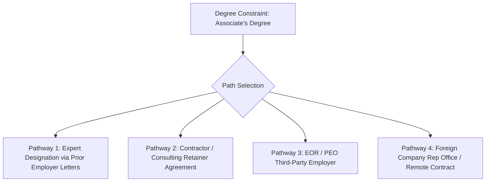
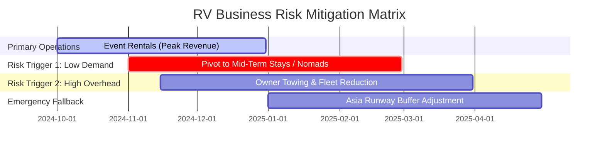
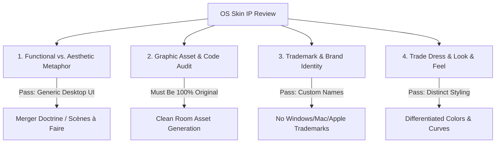
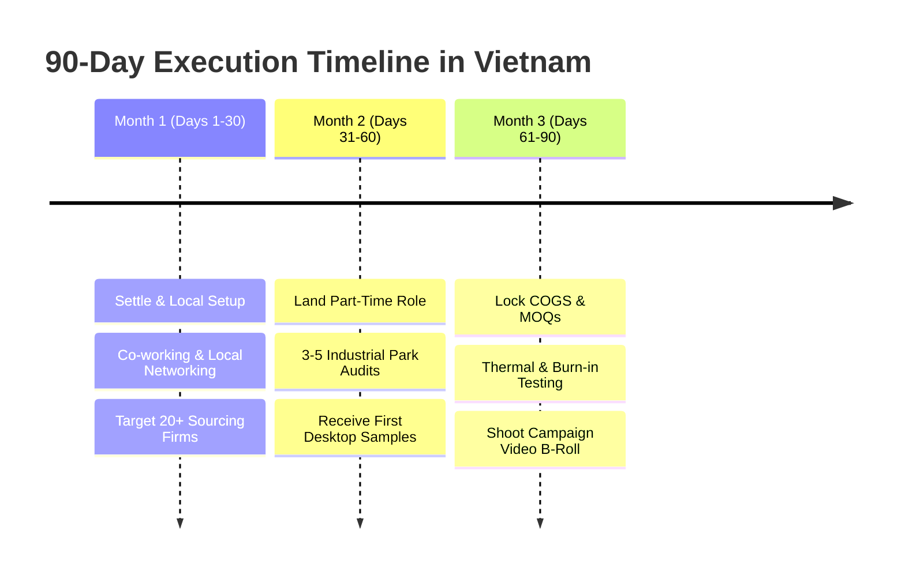

# Omarchy & Asia Relocation: Master Operational Playbook

---

## 1. Top 5 Red Flags When Vetting Suppliers for the Desktop Tier ($140–$165 COGS Target)

When sourcing refurb hardware or barebones Mini-PCs for the $199/$349 tiers, maintaining tight margin integrity and batch quality is non-negotiable. Watch for these 5 critical warning signs:

### Red Flag 1: Component Degradation & Batch Variance ("Lottery" Inventory)
* **The Risk:** Suppliers sourcing refurbished motherboards, SSDs, or RAM often mix grades within a single batch. Unit #1 might test fine, while Unit #50 uses degraded flash memory with high failure rates or thermal throttling under continuous boot cycles.
* **Vetting Action:** 
  * Require a written **Grading Standard Protocol** (e.g., Grade A/A- criteria specifying max cosmetic wear, zero bad sectors on storage, SMART health status >90%).
  * Include a contract clause requiring 100% individual burn-in testing (24-hour MemTest + stress test) before shipment.

### Red Flag 2: MOQ Bait-and-Switch & Hidden Nontariff/License Costs
* **The Risk:** A supplier quotes $140/unit at a 100-unit MOQ to win your interest, but when you place the Kickstarter production order, they claim component prices rose and demand an MOQ of 1,000+ or raise the price to $185/unit.
* **Vetting Action:** 
  * Request a **Tiered MOQ Pricing Matrix** upfront ($140 at 500 units, $135 at 1,000 units, $130 at 2,000 units) backed by a 90-day price lock agreement.
  * Clarify whether quotes include OS license clearance, power supply regional certifications (UL/CE), and packaging.

### Red Flag 3: Lack of Valid Compliance & Safety Certifications (CE, FCC, RoHS)
* **The Risk:** Custom enclosures, power supply units (PSUs), or refurbished mainboards lacking valid FCC/CE/RoHS certifications will be seized at customs (US/EU/Australia) or trigger product liability issues.
* **Vetting Action:** 
  * Request official test reports with lab certificate numbers. Cross-reference certificate numbers on the issuing lab's verification portal to detect forged PDFs.

### Red Flag 4: Resistance to Third-Party Pre-Shipment Inspection (PSI)
* **The Risk:** Suppliers who refuse access to factory floors or third-party quality control agencies (e.g., QIMA, V-Trust) often hide high defect rates or sub-contracting to unvetted workshops.
* **Vetting Action:** 
  * Include the **"Right to Inspect"** clause in all purchase orders: *"Final payment (70%) is contingent upon passing a 3rd-party AQL 2.5 inspection on-site."*

### Red Flag 5: Absence of EOL (End-of-Life) & Spare Parts Commitment
* **The Risk:** Refurbished hardware lines disappear quickly. If a motherboard model goes EOL mid-campaign, you cannot supply identical replacement units for warranty claims or late backers.
* **Vetting Action:** 
  * Require the supplier to guarantee a **3% to 5% buffer of spare parts** (mainboards, power bricks, RAM) dedicated to warranty fulfillment for at least 12 months post-shipment.

---

## 2. Job Search Strategy for Vietnam Sourcing Roles (Accounting for Associate's Degree)

### Navigating Vietnam Work Permit Rules (Decree 152/2020/ND-CP)
Officially, Vietnam work permits for foreign "Experts" require a Bachelor's degree AND 3 years of relevant experience. However, there are 4 legal & operational pathways to secure employment:

1. **Expert Designation via Prior Employer Letters (Recommended):** Decree 152 allows experience letters (showing 3–5 years of operational/sourcing/technical experience certified by foreign companies) to substitute for formal degree requirements in specific technical roles.
2. **Contractor / Freelance Retainer:** Work on a monthly consulting retainer for foreign buying houses or electronics brands. Payments flow to your US/international account while you stay on long-term business/investor visas.
3. **Third-Party Employer of Record (EOR / PEO):** Mid-sized Western supply chain agencies often hire via EOR structures (e.g., Deel, Remote.com) where visa requirements can be handled with specialized job titles.
4. **Foreign Representative Office:** Work for a US/Australian hardware company with a rep office in HCMC.

### Positioning & Resume Framing
* **Title to Target:** *Field Quality Assurance Inspector*, *Supply Chain Operations Associate*, *Vendor Audit Coordinator*, *Hardware Sourcing Specialist*.
* **Value Proposition:** Frame your Applied Arts degree + hands-on solo operations background as **Practical Design for Manufacturing (DFM) & Hardware Execution**.
* **Key Resume Highlights:**
  * Direct experience in rapid prototyping, hardware assembly, and BOM (Bill of Materials) cost breakdown.
  * Willingness to travel extensively to factories in Binh Duong, Dong Nai, and Bac Ninh.
  * Technical literacy in hardware stress testing, QA/QC documentation, and local vendor negotiation.

### Outreach Strategy & Channels
* **Direct Outreach to Western Buying Houses in HCMC & Hanoi:** Target SMEs operating in Vietnam (e.g., dragon-sourcing.com, standardprocurement.com, or hardware startups scaling in SE Asia).
* **LinkedIn Networking Filter:** Search for *Sourcing Director Vietnam*, *Supply Chain Manager Ho Chi Minh*, *Operations Lead Vietnam Electronics*. Send high-intent cold DMs: *"In HCMC Q1 2025; available for field audits & factory QC 25-30 hrs/wk."*
* **Chamber of Commerce Job Boards:** Monitor job listings on AmCham Vietnam (amchamvietnam.com), EuroCham Vietnam, and AusCham Vietnam.

---

## 3. Contingency Plans for RV Rental Business (Q4 2024 Buffer Protection)

To protect your $2,000–$3,000/month runway for the Asia relocation, structure these tiered contingency measures:

### Plan A: Demand Volatility (Events Underperform)
* **Trigger:** Off-season bookings fall below $800/month per rig or event bookings cancel.
* **Pivot Actions:**
  * **Mid-Term Housing Listings:** List rigs on **Furnished Finder** and **Airbnb Mid-Term** (30+ day stays) for traveling nurses, remote tech workers, or temporary corporate relocations near major regional hubs.
  * **Insurance Temporary Housing Partnerships:** Register rigs with insurance placement agencies (e.g., ALE Solutions) as emergency housing replacements for displaced homeowners.
  * **Winery / Agritourism Revenue Share:** Shift from flat nightly fees to a 70/30 revenue share with popular hipcamp/winery hosts to guarantee zero site-fee overhead.

### Plan B: Operational & Maintenance Cost Creep
* **Trigger:** Driver wages ($1,500–$2,000/mo) or tow vehicle repairs erode net margins below $1,500/mo total.
* **Pivot Actions:**
  * **Consolidate Fleet Size:** Hold at **1 or 2 rigs** through Q1 2025 instead of scaling to 3. Preserves cash flow and prevents over-leveraging family/bootstrapped capital.
  * **Owner Towing & On-Site Management:** Temporarily eliminate hired drivers; handle towing and site setup personally while finalizing Kickstarter copy and OS skins.

### Plan C: Cash Runway Preservation for Asia Trip
* **Trigger:** Net RV income falls below $1,500/month going into January 2025.
* **Pivot Actions:**
  * **Remote Freelance Buffer:** Take 10–15 hours/week of remote freelance work (CAD/DFM consulting, Shopify store setup, hardware copywriting) to plug the $1,000/mo shortfall.
  * **Lean Asia Setup:** Lower initial Asia liquid capital buffer requirement from $15,000 to $8,000–$10,000 by staying in serviced coliving spaces (e.g., HCMC District 3 / Phu Nhuand) rather than long-term lease commitments.

---

## 4. IP Review Process for OS Skins: Legal Audit Checklist

Recreating classic operating system UI eras (90s Files & Folders, 2000s Web, Mid-2000s Linux) presents low copyright risk for *functional mechanics*, but high trademark/trade dress risk if aesthetic elements are copied directly.

### What the IP Lawyer Will Check:

#### 1. Functional vs. Aesthetic Metaphors (The Merger Doctrine & Scènes à Faire)
* **What's Safe:** Window management (minimize, maximize, close buttons), taskbars, desktop icons, directory trees, and start menus are functional user-interface paradigms. They cannot be copyrighted.
* **What Lawyer Checks:** Ensuring the underlying windowing manager code uses open-source GUI libraries (e.g., Qt, Electron, GTK, XFCE/Wayland custom skins) without copying proprietary system code.

#### 2. Graphic Asset & Code Audit (Clean-Room Verification)
* **What's Unsafe:** Using actual extracted bitmaps, sound files (boot chimes), icons (e.g., original Windows 95 `My Computer` icon or Apple `Trash` can), or proprietary system fonts (e.g., Tahoma, Segoe UI, Chicago).
* **What Lawyer Checks:**
  * Verification that 100% of icons, cursors, sound effects, and wallpapers are **original vector artwork** or open-source permissive assets (MIT/CC0).
  * Proof of "clean-room" creation process (designers created assets from scratch without tracing proprietary source files).

#### 3. Trademark & Brand Identity Clearance
* **What's Unsafe:** Using registered names like *"Windows"*, *"Win95"*, *"Mac OS"*, *"Aqua"*, *"Finder"*, *"Internet Explorer"*, or brand logos.
* **What Lawyer Checks:**
  * OS skin naming convention audit. Recommended generic names:
    * *90s Era:* **"Omarchy Classic 95"** or **"Workspace 98"**
    * *Early 2000s Web Era:* **"DotCom 2000"** or **"NetSurfer OS"**
    * *Mid-2000s Linux Era:* **"OpenTux 2006"** or **"Penguin Desktop"**

#### 4. Trade Dress & "Look and Feel" Overall Confusion Test
* **What's Unsafe:** A design so visually identical that a consumer could reasonably believe Microsoft, Apple, or Canonical produced or endorsed Omarchy.
* **What Lawyer Checks:**
  * Ensuring color schemes, window border radii, and button shapes have subtle differences (e.g., using 3-stop gradients instead of Apple's exact 2001 gel button spec).
  * Prominent placement of **Omarchy branding** on boot screens and system settings to eliminate buyer confusion.

---

## 5. 90-Day Plan for First 3 Months in Vietnam (HCMC / Hanoi)

### Month 1: Days 1–30 — Arrival, Setup & High-Intent Networking
* **Goal:** Establish local base, secure part-time role pipeline, initiate hardware vendor mapping.
* **Week 1 (Logistics & Base Setup):**
  * Land in HCMC (District 3 or Phu Nhuan) or Hanoi (Tay Ho / Ba Dinh).
  * Acquire local eSIM (Viettel/Vinaphone), open multi-currency account (Wise/Wio), and get monthly pass at local tech co-working space (e.g., Dreamplex, CirCO, or Toong).
* **Week 2 (Job Outreach & Agency Contact):**
  * Submit customized resume & experience portfolio to 20 local supply chain agencies and Western buying houses in Vietnam.
  * Attend local business networking events (AmCham Vietnam Tech Committee, EuroCham Supply Chain Night, hardware founder meetups).
* **Weeks 3–4 (Initial Supplier Discovery):**
  * Visit local electronics wholesale markets (e.g., Nhat Tao Computer Market in HCMC) to inspect component supply chains and refurbish networks.
  * Compile preliminary list of 10 local electronics assembly factories in Binh Duong and Dong Nai industrial zones.

### Month 2: Days 31–60 — Job Landing, Factory Audits & Initial Samples
* **Goal:** Finalize part-time employment/contractor role, inspect supplier factories on-site, receive initial Desktop prototypes.
* **Weeks 5–6 (Role Onboarding & Scheduling):**
  * Finalize contract for 20–30 hr/week sourcing/QC inspection role ($1,200–$1,500/month).
  * Establish structured schedule: **Mon/Wed/Fri = Day Job (Factory audits)** | **Tue/Thu/Sat = Omarchy Execution**.
* **Weeks 7–8 (On-Ground Factory Vetting):**
  * Perform on-site audits of 3 short-listed electronics manufacturers/refurb integrators in Binh Duong / Bac Ninh.
  * Issue RFQ (Request for Quote) for Desktop Standard ($199 tier) and Desktop Premium ($349 tier) with explicit BOM, target COGS ($140–$165), and AQL 2.5 QC standard.
  * Pay for physical sample builds of custom Mini-PC enclosures and refurb motherboards.

### Month 3: Days 61–90 — Sample Teardown, Supplier Lock-In & Video Production
* **Goal:** Lock final COGS & MOQ agreements, validate hardware thermally/functionally, shoot campaign video b-roll inside real factories.
* **Weeks 9–10 (Sample Testing & Teardown):**
  * Receive physical Desktop and TV Maker Kit samples at your Vietnam base.
  * Conduct rigorous burn-in testing (48-hour continuous stress test, thermal throttling analysis, OS era skin responsiveness).
  * Conduct DFM teardown; optimize component selection with factory engineers to shave $10–15 off COGS.
* **Weeks 11–12 (Supplier Lock-In & Kickstarter Assets):**
  * Sign initial **Supplier Agreement & Price Lock** with primary manufacturer (dependent on Kickstarter hitting funding threshold).
  * Hire local freelance videographer ($500–$1,000) to film high-impact Kickstarter video b-roll: on-site factory assembly, hands-on prototype testing, and founder story in Vietnam.
  * Finalize Kickstarter campaign preview link with actual factory quotes and locked shipping rates.

---
*Playbook generated for Omarchy Kickstarter Launch & Asia Relocation Strategy.*
