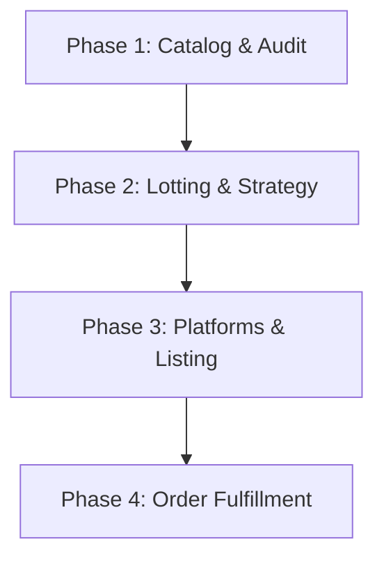

# LEGO Collection Sales Strategy Plan

This document outlines the proposed strategy and step-by-step plan for selling the collection of **19 LEGO sets** identified in this conversation.

---

## User Review Required

Before proceeding with listing any items, please review the proposed strategy and confirm your preferences for the following key decisions:

> [!IMPORTANT]
> **Priority Decision: Bulk Lot vs. Individual Sales**
> * **Option A (Highest Value):** Sell each set individually (specifically the high-value sets like **6082 Fire Breathing Fortress**, **1974-3 Smuggler's Hayride**, and **1877 Crusader's Cart**). 
    * *Pros:* Optimizes total profit (expected yield: $500–$650+).
    * *Cons:* Requires listing, packing, and shipping 10+ separate packages.
* **Option B (Fastest/Easiest):** Group the entire collection into a single "Vintage LEGO Lot" (excluding or including the McDonald's sets) on eBay.
    * *Pros:* One listing, one shipping box, very quick turnaround.
    * *Cons:* Reduced overall yield (bulk buyers usually expect a 30%–40% discount).

> [!WARNING]
> **Minifigure & Part Audits**
> Vintage LEGO values are heavily driven by the presence of specific minifigures (e.g., the Dragon Master in 6082, the Forestmen in 1974-3/1877). Missing a single key accessory or shield can slash a set's value by 30%–50%. We must audit the exact completeness of the sets before listing.

---

## Open Questions

Please provide feedback on the following questions to help refine this plan:
1. **Minifigures:** Are all the minifigures pictured on the instruction booklets present and in good condition (no cracks in arms/torso)?
2. **Completeness:** Are the sets 100% complete with all pieces, or are there known missing parts?
3. **Boxes:** Do you have the original boxes for any of these sets, or just the instruction sheets/loose parts?
4. **Time vs. Money:** Do you prefer to maximize your cash return (individual sales) or get this done with the least effort (bulk lot)?

---

## Proposed Phase-by-Phase Plan

### Phase 1: Catalog & Audit (Condition & Completeness)
1. **Part Verification:** Group loose bricks by set. Use [Rebrickable](https://rebrickable.com) inventories to verify completeness.
2. **Minifigure Inspection:** Inspect figures for common damage (loose torso joints, hairline cracks on the sides of the torso, faded printing).
3. **Cleaning (If needed):** If sets are dusty, wash pieces in lukewarm soapy water (do not wash stickers or instructions) and let air dry.

---

### Phase 2: Lotting Strategy (Grouping for Sale)
To optimize shipping costs and listing effort, we propose grouping the sets into the following lots:

* **Lot 1: The High-Value Castle Lot**
  * Sets: **6082** Fire Breathing Fortress, **1974-3** Smuggler's Hayride, **1877** Crusader's Cart.
  * *Strategy:* Sell individually on eBay or BrickLink. These are highly collectible and will attract dedicated castle fans.
* **Lot 2: Retro Space Collector's Pack**
  * Sets: **6887** Allied Avenger, **1875** Meteor Monitor, **1974-4** Star Quest, **1462** Galactic Scout, **1969** Mini Robot, **6834** Celestial Sled.
  * *Strategy:* Can be sold individually or as a single "Vintage Space Lot" on eBay to save on shipping.
* **Lot 3: McDonald's & Small Promos Lot**
  * Sets: **1644**, **1645**, **1647**, **1958**, **1959**, **1628**, **1974-2**, **1876**.
  * *Strategy:* Group these into a single "Vintage LEGO Grab Bag/Stocking Stuffer Lot" for $40–$50. Selling these individually is not cost-effective due to postage fees.

---

### Phase 3: Platform Selection
* **eBay (Recommended for speed and ease):** Best for vintage lots. Use "Buy It Now" with "Best Offer" enabled, priced slightly above market average.
* **BrickLink / Brick Owl:** Best if you are willing to set up a store and sell to hardcore collectors. Requires accurate inventory grading.
* **Facebook Marketplace / Local (No shipping):** Good for local cash pick-up to avoid fees, but harder to find vintage collectors who appreciate the value of these specific sets.

---

## Verification Plan

### Manual Verification
- [ ] User confirms their priority (bulk vs. individual).
- [ ] User audits the inventory and logs any missing pieces/minifigures.
- [ ] Draft eBay/BrickLink listings with optimized search keywords (e.g., "Vintage LEGO 6082 Complete with Instructions").
