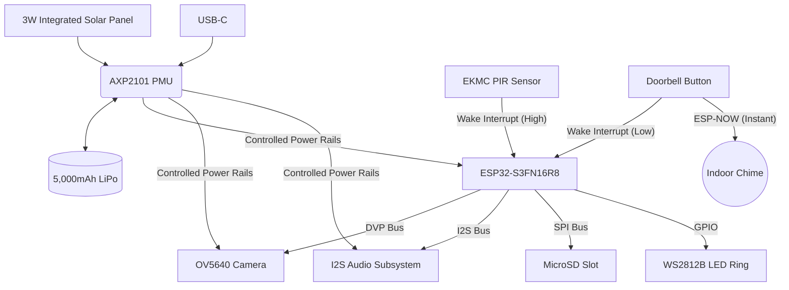

# OpenDoor PCB: Bill of Materials (BOM) & Hardware Architecture

This document outlines the core hardware components required for the custom OpenDoor Printed Circuit Board (PCB). The design is optimized for battery-powered operation, fast wake-up times, and capable video streaming.

## 🧠 Core Processing & Vision (Production Target)
> [!NOTE]
> Prototyping will be done on the **LILYGO T-Camera S3** to validate the firmware flow, but the production PCB targets the footprint and ultra-low power architecture of the **Seeed XIAO ESP32S3 Sense**.

| Component | Description | Estimated Cost (Volume) | Purpose |
| :--- | :--- | :--- | :--- |
| **ESP32-S3FN16R8** | Dual-core XTensa LX7 MCU with Wi-Fi/BLE, 16MB Flash, and 8MB PSRAM. | $2.50 | The brain of the doorbell. Capable of hitting ~14 µA deep sleep at the chip level while providing the PSRAM necessary for video buffering. |
| **OV5640 Camera Module** | 5 Megapixel CMOS image sensor. | $3.50 | Captures video. Better low-light performance than the older OV2640. Connects via DVP. |
| **MicroSD Card Socket** | Standard push-pull MicroSD slot. | $0.25 | For standalone local video recording (SPI or SDIO interface to ESP32). |

## 🔋 Power Management & Integrated Solar
> [!IMPORTANT]
> The ESP32 consumes a lot of power while streaming video (~160-280mA). To achieve true 3-6 month battery life, the entire board (not just the chip) must be heavily managed by a dedicated Power Management Unit (PMU) to sit below 300 µA in sleep.

| Component | Description | Estimated Cost (Volume) | Purpose |
| :--- | :--- | :--- | :--- |
| **AXP2101 PMU** | Advanced Power Management Unit. | $1.10 | Crucial for fine-grained power rail control. It allows us to completely shut down power to the camera, SD card, and audio amp during deep sleep, achieving ultra-low board-level standby current. |
| **3W Monocrystalline Panel** | ~120 × 80 mm custom integrated solar panel. | $2.50 | Mounted directly into the angled top face of the enclosure. Yields 2-4 Wh/day in typical conditions, enough to keep the unit charged indefinitely under normal use. |
| **PIR Motion Sensor** | e.g., Panasonic EKMC1603111. | $1.20 | Extremely low-power passive infrared sensor. Fast trigger time. Output is tied directly to the ESP32 wake interrupt pin. |
| **18650 Li-Ion Battery** | Holds 1x or 2x 18650 cells (e.g., 3.7V, 5000mAh total). | $1.50 | Primary power source. The AXP2101 handles the charge management from the solar panel and USB-C port. |

## 🎤 Audio (Two-Way Talk)
| Component | Description | Estimated Cost (Volume) | Purpose |
| :--- | :--- | :--- | :--- |
| **INMP441 (or ICS43434)** | I2S Omnidirectional MEMS Microphone. | $0.80 | Digitizes audio directly into the ESP32 via the I2S bus, avoiding the need for an analog-to-digital converter (ADC) and reducing noise. |
| **MAX98357A** | I2S Class D Audio Amplifier. | $0.60 | Takes digital audio from the ESP32 and amplifies it to drive the speaker. |
| **8 Ohm, 1W Speaker** | Small, weatherproof mylar speaker. | $0.50 | Outputs the user's voice from the app. |

## 💡 User Interface & Connectivity
| Component | Description | Estimated Cost (Volume) | Purpose |
| :--- | :--- | :--- | :--- |
| **Vandal-Resistant Pushbutton** | Weatherproof momentary switch. | $1.50 | The main doorbell button. Connected to an ESP32 wake-up pin. |
| **WS2812B RGB LEDs** | Programmable LED ring (4-6 LEDs) placed around the button. | $0.40 | Provides visual feedback (e.g., spinning blue when ringing, solid green when charging). |
| **USB-C Port** | Waterproof USB-C receptacle. | $0.30 | Used for manual charging (if needed) and flashing firmware. |

---

## 📐 Architecture Flow

