# OpenLooper: Hardware Cost Breakdown & Bulk Savings Projections

This document provides a granular item-by-item breakdown of the manufacturing cost of a single **OpenLooper** wireless looper pedal unit (optimized setup featuring I2S audio codec and Orange Pi host) compared against volume pricing tiers at **50+ units** and **500+ units**.

---

## 📊 Detailed Cost Breakdown Table

| Component Category | Single-Unit DIY | Bulk Tier 1 (50+ units) | Savings (%) | Bulk Tier 2 (500+ units) | Savings (%) | Primary Sourcing Channels |
|:---|:---:|:---:|:---:|:---:|:---:|:---|
| **Host SBC** (Orange Pi Zero 3 2GB) | $30.00 | $22.00 | 26.6% | $18.00 | 40.0% | Shenzhen Xunlong Software / Wholesale |
| **I2S Stereo Audio Codec** (CS4272 board) | $20.00 | $13.00 | 35.0% | $9.00 | 55.0% | LCSC Electronics / Custom Fab |
| **Controller MCU** (RP2040 Pico) | $6.00 | $3.50 | 41.6% | $2.20 | 63.3% | Raspberry Pi Authorized Distributors |
| **Footswitches** (6x SPST Mom-Off Stomp) | $15.00 | $9.00 | 40.0% | $6.00 | 60.0% | Daier Electron / Alpha OEM |
| **WS2812B Rings** (6x 24-LED rings) | $12.00 | $7.50 | 37.5% | $5.00 | 58.3% | Worldsemi / Direct Manufacturer |
| **Enclosure** (Hammond 1590XX Aluminum) | $15.00 | $9.50 | 36.6% | $7.00 | 53.3% | Tayda Electronics / CNC Wholesale |
| **PCB Fab & Buffer Components** | $10.00 | $5.00 | 50.0% | $2.80 | 72.0% | JLCPCB / PCBA Batch Order |
| **Chassis Jacks & Connectors** (Audio, USB) | $8.00 | $4.50 | 43.7% | $3.00 | 62.5% | Neutrik OEM / Rean Connectors |
| **USB-C Power Supply** (5V 3A) | $15.00 | $9.00 | 40.0% | $6.00 | 60.0% | Mean Well OEM / Anker Wholesale |
| **Packaging & Labeling Box** | $5.00 | $2.00 | 60.0% | $1.00 | 80.0% | Custom cardboard manufacturer |
| **Total Hardware Cost (COGS)** | **$136.00** | **$85.00** | **37.5%** | **$60.00** | **55.8%** | — |

---

## 📈 Scaled Profit Margin Projections

By keeping the pledge level at the planned **$249.00** target tier, the gross margins scale dramatically as backing volume increases:

```mermaid
gantt
    title Gross Profit Margins by Volume Tier (Target: $249 Price)
    dateFormat  X
    axisFormat %s
    section DIY Single Unit
    Cost ($136) :active, 0, 136
    Profit ($113) :crit, 136, 249
    section 50+ Units
    Cost ($85) :active, 0, 85
    Profit ($164) : 85, 249
    section 500+ Units
    Cost ($60) :active, 0, 60
    Profit ($189) : 60, 249
```

* **Single Unit DIY / Kit Margins**: **45.3%** ($113 profit per unit)
* **Tier 1 (50+ units) Margins**: **65.8%** ($164 profit per unit)
* **Tier 2 (500+ units) Margins**: **75.9%** ($189 profit per unit)

> [!TIP]
> At 500+ units, the **76% gross profit margin** puts OpenLooper in an exceptionally strong financial position. This provides ample headroom to cover Kickstarter platform fees (5%), payment processing fees (3-5%), and potential shipping adjustments without risking project solvency.
