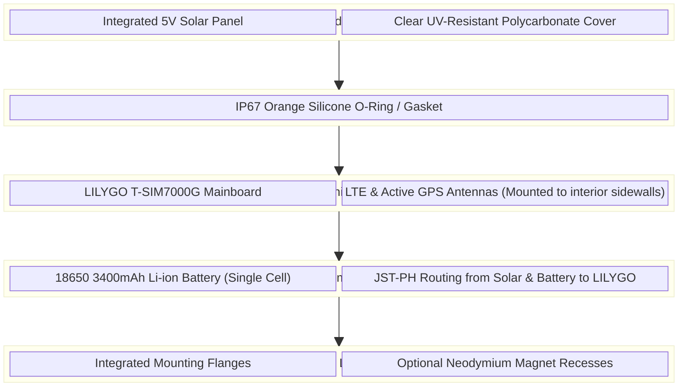

# Industrial Design Concept: Tier 1 Infinite Solar Edition

This document outlines the conceptual industrial design and internal architecture for the **Tier 1 Infinite Solar Edition** tracker, designed to house the LILYGO T-SIM7000G board.

## Exterior Concept Rendering

### Key Design Features
1.  **Solar Lid:** A flush-mounted ~1W 5V solar panel integrated directly into the top casing, providing constant trickle-charging to the internal battery during daylight hours.
2.  **Rugged IP67 Enclosure:** Matte black, UV-resistant ABS/Polycarbonate blend designed to withstand harsh marine and automotive environments.
3.  **Mounting Flanges:** Heavy-duty side flanges with pre-drilled holes for secure screw/bolt mounting to boats, RVs, and heavy equipment.
4.  **Weatherproof Gaskets:** High-visibility orange silicone gaskets ensure a watertight seal for the primary enclosure seam and any external ports.

---

## Internal Architecture & Layer Schematic

To accommodate the off-the-shelf LILYGO board without custom PCBA engineering, the enclosure is designed in stacked layers.

### Manufacturing Notes for Tier 1
Because you are fulfilling Tier 1 early, you can avoid expensive steel injection-molding tooling initially. 
*   **Initial Run (Sub 500 units):** Can be manufactured using high-quality Multi Jet Fusion (MJF) 3D printing (Nylon PA12) or CNC machining, which requires zero upfront tooling costs. 
*   **Scale Run (500 - 2,000 units):** Transition to basic injection molding. The "blocky" design shown above requires simple 2-part molds without complex side-actions, keeping tooling costs under ~$3,000.
