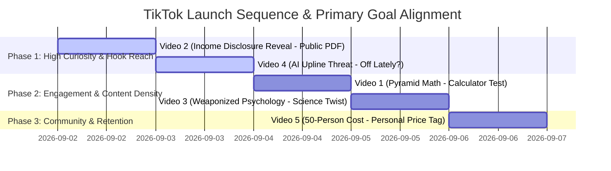

# 🎬 MLM Decoded — TikTok Launch Pack (Native Creator Master Blueprint)

> **Source Material:** [nothing-absolute.github.io/mlm-truth](https://nothing-absolute.github.io/mlm-truth/)  
> **Production Aesthetic:** Raw, organic handheld selfie + authentic phone screen-recordings. **No polished graphic packages, lower-thirds, or stock B-roll.** (TikTok algorithms & viewers penalize over-produced content that looks like an ad).

---

## ⚡ Global TikTok Creator Guidelines & Specs

| Rule / Feature | Operational Standard | Rationale |
| :--- | :--- | :--- |
| **Audio Format** | **Original Creator Audio (Your Voice)** | Native default for founder/investigative content. No forced trending music tracks. |
| **Sound Stingers** | **Native SFX Only (Whoosh, Ding, Record-Scratch)** | Used sparingly only on actual beats / pattern interrupts. |
| **3-Part Hook** | **Land within < 1.5 Seconds** | Text-on-screen + Spoken VO + Visual Action simultaneously. No intro slides, logos, or "hey guys." |
| **Mid-Video Re-Hook** | **Pattern Interrupt at ~14–18s** | Prevents the common 15-second drop-off curve with a camera push, tone shift, or whoosh SFX. |
| **Looping & CTAs** | **Goal-Specific Endings** | Videos loop seamlessly back to opening visual frame OR end on targeted friction questions to drive comments/saves. |
| **SEO Captions** | **Max 5 Targeted Hashtags** | High-intent keywords only. Zero generic filler tags (`#fyp`, `#viral`). |

---

## 📅 Recommended Release Strategy & Goal Breakdown

| Video | Primary Goal | Target SEO Keywords | Loop / End Trigger |
| :--- | :--- | :--- | :--- |
| **Video 1: Pyramid Math** | **Comments** (Numeric guessing & calculation) | `MLM math`, `pyramid scheme recruiting`, `MLM pyramid explained` | Seamless visual loop back to phone calculator in hand |
| **Video 2: Income Disclosure** | **Comments + Follows** (Naming company for Part 2) | `MLM income disclosure statement`, `MLM income truth`, `do MLMs make money` | Return phone to opening scroll position; prompt company names |
| **Video 3: Weaponized Psych** | **Saves + Shares** (High utility / emotional proof) | `MLM psychology`, `growth mindset MLM`, `MLM manipulation tactics` | Warm save/send CTA ("Save this and send it to them") |
| **Video 4: AI Upline** | **Reach + Comments** (Tech-fear hook) | `AI MLM`, `AI upline`, `synthetic MLM mentor`, `AI scam` | Frame loop back to opening "has it felt off?" visual |
| **Video 5: 50-Person Cost** | **Follows + Community** (Catharsis & solidarity) | `MLM relationships`, `MLM ruined friendships`, `leaving an MLM` | Soft comment CTA ("Comment 'me' if this hit home") |

---

## 📹 Full Video Breakdown & Production Docs

### 🟢 VIDEO 1 — Pyramid Math (Calculator Test)
* **Goal:** Comments (Numeric calculation bait) | **Runtime:** ~32s
* **Hook Picked (#2):** Spoken: *"Pull out your calculator right now."* | Visual: Handheld selfie, thumb hovering over calculator.

#### Hook Options for A/B Testing:
1. `Option 1:` Text: "5 people. That's all it takes." / Spoken: "Your upline says just recruit 5 people."
2. **`Option 2 (PICKED):`** Text: "Type this into a calculator." / Spoken: "Pull out your calculator right now."
3. `Option 3:` Text: "This breaks by level 13." / Spoken: "There's a number your MLM upline hopes you never calculate."

#### Production Doc:
| # | Shot | On-Screen Text | Spoken Line | Sound | Timing |
| :-: | :--- | :--- | :--- | :--- | :-: |
| **1** | Handheld selfie, phone calculator app open, thumb hovering | `TYPE THIS IN 👇` | "Pull out your calculator right now. I'm serious." | Original audio | 0:00–0:02 |
| **2** | Screen-record: typing `5` then `^13` | `5 × 5 × 5... 13 times` | "Type 5, then the power button, then 13. That's it — recruit 5 people, 13 levels deep." | Original audio | 0:02–0:07 |
| **3** | Screen-record: hit equals, number fills screen (`1,220,703,125`) | `1,220,703,125` | "Hit equals." *(pause, let number sit)* | Record-scratch SFX on equals tap | 0:07–0:10 |
| **4** | Cut back to selfie, dead serious | `MORE PEOPLE THAN EXIST` | "That's over 1.2 billion people. More humans than most countries have EVER had." | Original audio | 0:10–0:14 |
| **5** | **[RE-HOOK]** Quick zoom-in, tone shift | `But here's the part they don't say` | "But wait — it's worse than that." | Whoosh SFX | 0:14–0:16 |
| **6** | Screen-record: Google search for world population (`8.2 Billion`) | `8.2 BILLION humans on Earth. Total.` | "There are 8.2 billion people on the entire planet. We ran out of humans before level 13 finished." | Original audio | 0:16–0:21 |
| **7** | Selfie, leaning into camera lens | `So 'everyone can win' is mathematically a lie` | "So when someone tells you 'there's room for everyone at the top' — there isn't room on the PLANET. It's not a business plan. It's arithmetic." | Original audio | 0:21–0:27 |
| **8** | **[LOOP BACK]** Same framing as Shot 1 — calculator back up | `Try YOUR upline's recruit number 👇` | "Comment the number your upline told you to recruit. I'll do the math on your exact one." | Original audio, light Ding SFX on "comment" | 0:27–0:32 |

* **Caption:** `Do this math with your own upline's recruit number and watch what happens 🧮 the MLM pyramid math they never want you to run #mlm #antimlm #pyramidscheme #mlmmath #networkmarketing`

---

### 🟢 VIDEO 2 — Income Disclosure Reveal (Public PDF)
* **Goal:** Comments + Follows (Company breakdown bait) | **Runtime:** ~33s
* **Hook Picked (#1):** Spoken: *"MLMs have to publish this. Almost nobody does."* | Visual: Holding up phone with PDF open, thumb scrolling.

#### Hook Options:
1. **`Option 1 (PICKED):`** Text: "This document is public. Nobody shows it to you." / Spoken: "MLMs have to publish this. Almost nobody does."
2. `Option 2:` Text: "Less than 1%." / Spoken: "Guess what percent of MLM distributors actually make money."
3. `Option 3:` Text: "I read the fine print so you don't have to." / Spoken: "I found the document your upline never mentions."

#### Production Doc:
| # | Shot | On-Screen Text | Spoken Line | Sound | Timing |
| :-: | :--- | :--- | :--- | :--- | :-: |
| **1** | Handheld, phone held up with plain disclosure doc scrolling | `PUBLIC DOCUMENT. NOBODY SHOWS YOU THIS.` | "MLMs are legally required to publish this. Almost nobody in the business shows it to you." | Original audio | 0:00–0:03 |
| **2** | Screen-record: scrolling down a clean custom stat sheet | `Income Disclosure Statement` | "It's called an income disclosure. It has to show what the AVERAGE distributor actually makes." | Original audio | 0:03–0:08 |
| **3** | Cut to selfie, flat delivery | `Not the top earner. Everyone.` | "Not the person in the private jet. Everyone. Averaged." | Original audio | 0:08–0:11 |
| **4** | **[RE-HOOK]** Lean in close to lens | `Guess the number` | "Guess what percent actually turn a profit." | Snap-zoom SFX | 0:11–0:13 |
| **5** | Big text slam, hold 2 full seconds, no talking | `<1%` | *(silence — let it sit)* | Hard hit impact SFX | 0:13–0:16 |
| **6** | Selfie, dry tone | `Less than one percent make ANY profit` | "The FTC looked across the industry. Less than one percent make a profit — after the mandatory monthly purchases to stay 'active.'" | Original audio | 0:16–0:21 |
| **7** | Quick cut, wry half-smile | `Same odds as the lottery` | "So when someone says 'the top earners prove it's possible' — sure. So does the lottery." | Original audio | 0:21–0:25 |
| **8** | Selfie, direct and sincere | `They're not lying. They're just not showing you the other 99%.` | "The recruiter isn't lying about the top number. They just never show you everyone else." | Original audio | 0:25–0:29 |
| **9** | **[LOOP / CTA]** Hold phone back up like Shot 1 | `Comment your MLM 👇 I'll find the real number` | "Comment the MLM you were pitched. I'm pulling the real disclosure number for it next video." | Ding SFX | 0:29–0:33 |

* **Caption:** `MLM income disclosure statements are public — almost nobody reads them. Comment your MLM and I'll find the real number next 📄 #mlm #antimlm #incomedisclosure #ftc #mlmtruth`

---

### 🟢 VIDEO 3 — Weaponized Psychology (Science Twist)
* **Goal:** Saves + Shares (High emotional/utility density) | **Runtime:** ~40s
* **Hook Picked (#3):** Spoken: *"A real psychologist did this research. Your upline weaponized it."* | Visual: Hand raised "wait, listen" gesture.

#### Hook Options:
1. `Option 1:` Text: "Real psychologist. Twisted into a weapon." / Spoken: "Your upline stole this from an actual scientist."
2. `Option 2:` Text: "It's not your mindset." / Spoken: "If you've been told to 'believe harder' — this is for you."
3. **`Option 3 (PICKED):`** Text: "Real science. Then they twisted it." / Spoken: "A real psychologist did this research. Your upline weaponized it."

#### Production Doc:
| # | Shot | On-Screen Text | Spoken Line | Sound | Timing |
| :-: | :--- | :--- | :--- | :--- | :-: |
| **1** | Handheld, hand raised "hold on" gesture | `REAL SCIENCE. THEN THEY TWISTED IT.` | "A real psychologist did this research. Your upline weaponized it." | Original audio | 0:00–0:03 |
| **2** | Selfie, matter-of-fact | `Carol Dweck — real, peer-reviewed research` | "Carol Dweck. Growth mindset. Real, peer-reviewed — people get better at SKILLS through effort." | Original audio | 0:03–0:08 |
| **3** | **[RE-HOOK — Upline Cadence]** Lean in, mocking tone | `What your upline actually says:` | *(upline tone)* "'You didn't fail because the business is rigged. You didn't grind hard enough. Winners don't quit.'" | Original audio | 0:08–0:14 |
| **4** | Cut back to normal voice/energy, close to lens | `See what just happened?` | "See what just happened? A rigged structure that mathematically fails 99% of people — just became YOUR personal flaw." | Original audio | 0:14–0:20 |
| **5** | Slower, quieter delivery | `The system can never be wrong. So you have to be.` | "The system can never be wrong. So you have to be the problem." | Original audio *(no SFX)* | 0:20–0:24 |
| **6** | **[RE-HOOK #2]** Quick head-tilt | `Same trick, different quote:` | "Same trick with 'The Secret.'" | Whoosh SFX | 0:24–0:26 |
| **7** | "Upline voice" cadence again | `'Your bank account reflects your belief system.'` | *(upline tone)* "'Your bank account reflects your belief system. Fix your mindset. Buy the training.'" | Original audio | 0:26–0:31 |
| **8** | Normal voice, direct to camera, close | `IT'S NOT YOUR MINDSET. IT'S THE MATH.` | "It's not your mindset. It's the math. No amount of positive thinking fixes a structure built for most people to lose." | Original audio | 0:31–0:37 |
| **9** | **[CTA — Save-Driven]** Slight pull back, warm tone | `Save this. Send it to them.` | "If someone's ever told you to 'just believe more' — save this and send it to them." | Soft Ding SFX | 0:37–0:40 |

* **Caption:** `Real psychology research, twisted into an MLM manipulation tactic 🧠 save this and send it to someone who needs it — MLM psychology explained #mlm #antimlm #mlmpsychology #growthmindset #cultrecovery`

---

### 🟢 VIDEO 4 — AI Upline / Fully Automated MLM
* **Goal:** Reach + Comments (Unsettling tech-fear hook) | **Runtime:** ~38s
* **Hook Picked (#2):** Spoken: *"If your MLM upline's messages have felt a little off lately — there's a reason."* | Visual: Brow furrowed, showing generic phone screen.

#### Hook Options:
1. `Option 1:` Text: "Your upline might be a robot." / Spoken: "There's a real chance your MLM mentor isn't a real person."
2. **`Option 2 (PICKED):`** Text: "Has your upline felt... off lately?" / Spoken: "If your upline's messages have felt a little off lately — there's a reason."
3. `Option 3:` Text: "This took a human 8 hours. AI does it in 8 seconds." / Spoken: "Watch how fast AI just replaced your entire upline."

#### Production Doc:
| # | Shot | On-Screen Text | Spoken Line | Sound | Timing |
| :-: | :--- | :--- | :--- | :--- | :-: |
| **1** | Handheld, scrolling phone, brow furrowed, look up | `HAS YOUR UPLINE FELT OFF LATELY?` | "If your MLM upline's messages have felt a little off lately — there's a reason." | Original audio | 0:00–0:03 |
| **2** | Selfie, slightly lower energy/serious | `8 hrs of human work → 8 seconds of AI` | "Writing a motivational script used to take a human upline four to eight hours. AI does it in eight seconds." | Original audio | 0:03–0:08 |
| **3** | Quick cuts, counting fingers on camera | `Clone voice: 2 min. Fake video: 5 min. 500 DMs: 30 sec.` | "Clone their actual voice — two minutes. Generate a 'personal' video — five minutes. Five hundred personalized DMs — thirty seconds." | Fast tick counter SFX | 0:08–0:15 |
| **4** | **[RE-HOOK]** Leaning in, dropping voice | `Some uplines are already doing this` | "Some uplines are already doing exactly this — ChatGPT and Claude writing every script, every post. They just hit send." | Original audio | 0:15–0:20 |
| **5** | Pull back slightly, ominous pacing | `Next stage: AI clones doing check-in calls` | "Next stage is already close — an AI clone of your mentor's actual voice doing the check-in call. You'd think it's them." | Original audio | 0:20–0:26 |
| **6** | Direct to camera, stillness | `Final stage: no human upline at all` | "Final stage: a fully automated MLM. No real human anywhere in your upline. AI recruits you. AI trains you. AI blames you when it fails." | Original audio | 0:26–0:32 |
| **7** | **[LOOP BACK]** Same framing as Shot 1 | `So — has it felt off?` | "So. Has it felt a little off?" | Original audio | 0:32–0:35 |
| **8** | CTA Card, hold on face | `Comment below. You're probably right.` | "Comment below. If you already suspected it — you're probably right." | Ding SFX | 0:35–0:38 |

* **Caption:** `Your MLM upline might already be AI — here's how fast it happened 🤖 AI upline, synthetic mentors, fully automated MLMs are already here #mlm #antimlm #ai #syntheticmedia #mlmtruth`

---

### 🟢 VIDEO 5 — Social/Relationship Cost
* **Goal:** Follows + Community (Solidarity & catharsis) | **Runtime:** ~39s
* **Hook Picked (#1):** Spoken: *"Nobody tells you the real cost of an MLM is 50 people."* | Visual: Quiet sitting, softer energy.

#### Hook Options:
1. **`Option 1 (PICKED):`** Text: "50 people. That's the real price." / Spoken: "Nobody tells you the real cost of an MLM is 50 people."
2. `Option 2:` Text: "Count your group chats." / Spoken: "How many group chats have gone quiet on you?"
3. `Option 3:` Text: "This isn't about the money." / Spoken: "This one's not about the money."

#### Production Doc:
| # | Shot | On-Screen Text | Spoken Line | Sound | Timing |
| :-: | :--- | :--- | :--- | :--- | :-: |
| **1** | Sitting, quieter framing than other 4 videos | `50 PEOPLE. THAT'S THE REAL PRICE.` | "Nobody tells you the real cost of an MLM is 50 people." | Original audio *(no SFX)* | 0:00–0:03 |
| **2** | Still on camera, gentle pace | `The average distributor pitches 50+ people they know` | "The average distributor pitches over fifty people from their own life before they quit. Not strangers — people who already trusted them." | Original audio | 0:03–0:09 |
| **3** | Look down/away briefly, then back — reflective beat | `Close friends. Family. Coworkers. The group chat.` | "Close friends. Family. Coworkers. Your kid's soccer parents." | Original audio | 0:09–0:13 |
| **4** | **[RE-HOOK]** Quieter tone match | `It changes things even when nobody says it` | "And it changes the relationship — even when nobody says a word out loud. Calls get screened. Invitations stop." | Original audio | 0:13–0:19 |
| **5** | Direct, pointed delivery | `Your 'warm market' = your first 90 days of leads` | "You're taught your 'warm market' is your first ninety days of leads. The people who love you are the starter inventory." | Original audio | 0:19–0:25 |
| **6** | Pause, slower pacing | `Money comes back. A 2-year silent friendship is harder.` | "Money can be earned back. A friendship that went quiet for two years is a lot harder to rebuild." | Original audio | 0:25–0:30 |
| **7** | Direct to camera, sincere, close | `This isn't in the income disclosure. It's usually the regret people carry longest.` | "This is the cost that's not in any income disclosure. And it's usually the one people regret most." | Original audio | 0:30–0:35 |
| **8** | **[CTA — Community]** Warm, still | `Comment 'me' if this hit home. You're not alone.` | "If this hit home — comment 'me.' You're not alone in this." | Soft, warm tone | 0:35–0:39 |

* **Caption:** `The MLM cost that never shows up on an income disclosure 💔 if this hit home, comment 'me' — you're not alone #mlm #antimlm #mlmtruth #friendship #recovery`
