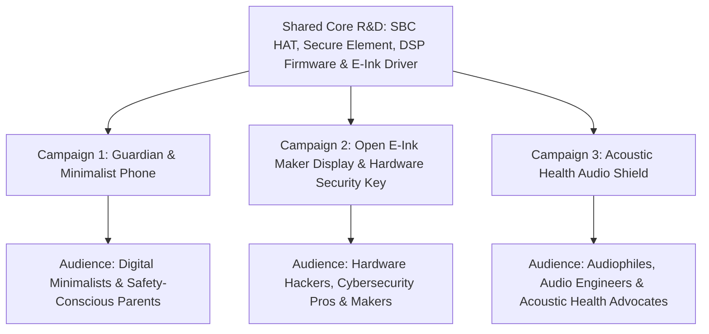

## UNDERTONE — Pitch Deck & Launch Strategy

**Multi-Campaign Hardware Ecosystem: Acoustic Health, Open E-Ink Maker Display, Password/FIDO2 Security Key & Guardian Devices**

### Slide 1: Executive Overview

#### UNDERTONE — Hear What You Can't. Control What You See.
*A modular ecosystem bridging acoustic wellness, open-source hardware, hardware security/authentication, digital minimalism, and child safety.*

- **Campaign 1 — Minimalist & Guardian Phone**: Low-dopamine dual-screen device & tamper-proof child phone powered by custom SBC HAT / OEM PCB inside CNC/3D-printed housing.
- **Campaign 2 — Open E-Ink Maker Board & Security Key**: Programmable USB-C/GPIO touch E-Ink platform, **hardware password vault & FIDO2/YubiKey authenticator**, audio monitoring, PC macro pads, & IoT control.
- **Campaign 3 — Sub-Harmonic Audio Shield**: Scientific infrasound (<20Hz) protection for audiophiles, studios, & mobile headphone users.

### Slide 2: The Core Problem & Tri-Market Opportunity

```
+-----------------------------------------------------------------------------------+
|                              QUAD-MARKET PROBLEM SPACE                            |
|                                                                                   |
|   +-----------------------+   +-----------------------+   +--------------------+  |
|   |  Acoustic Pollution   |   |   Screen Addiction    |   | Hardware Auth &    |  |
|   | Sub-20Hz Infrasound   |   | Hyper-Dopamine OLED   |   | Password Vulnerability|
|   | Nausea, Stress, HVAC  |   | Parent & Child Overload|   | Cloud Breach Risks |  |
|   +-----------------------+   +-----------------------+   +--------------------+  |
+-----------------------------------------------------------------------------------+
```

1. **Acoustic Noise Pollution**: Industrial sub-harmonics, HVAC, and unmastered media streams leak <20Hz infrasound, inducing fatigue and resonance without conscious awareness.
2. **Mobile Attention Capture & Child Safety**: OLED screens trap attention; children hack software parental controls via USB. Parents need tamper-proof physical devices.
3. **Password Security & Auth Vulnerability**: Soft 2FA apps and cloud password vaults are vulnerable to screen scrapers, SIM swaps, and malware. Users need an air-gapped physical hardware security token (YubiKey equivalent) with a visual E-Ink touch interface.

### Slide 3: Targeted 3-Kickstarter Campaign Strategy



### Slide 4: Campaign 1 — Minimalist & Guardian Phone

#### Low-Dopamine Phone for Adults & Tamper-Proof Safety for Kids
- **Hardware Architecture**: Custom PCB HAT designed for mass-produced SBCs (Raspberry Pi/Radxa), with a stretch goal for an all-in-one OEM board (E-Ink SBC on front, Android logic components + OLED on rear, battery & tactile buttons).
- **Custom Modular Cases**: Open-source CNC anodized aluminum and high-durability 3D-printable housing files.
- **Parental Guardian Lockout**: Factory-sealed "break-to-remove" casing permanently enclosing phone & SBC interconnects. Eliminates USB PC connectivity, stopping children from using ADB or sideloading to bypass parent controls.
- **LoRA Mesh Variant**: Optional cellular-free model running on 868/915MHz LoRA Mesh (Meshtastic protocol) for zero-solicitation, direct parent-child P2P contact.

### Slide 5: Campaign 2 — Open E-Ink Maker Board & Password/FIDO2 Vault (NEW)

#### Programmable USB-C/GPIO Touch E-Ink Display & Hardware Authenticator
- **Target Audience**: Makers, developers, cybersecurity professionals, and desk setup creators.
- **Hardware Security Element**: Integrated Secure Element chip (ATECC608 / TPM) + encrypted offline storage.
- **Featured Maker & Security Use Cases**:
  1. **Hardware Password Vault & YubiKey Alternative**: Functions as a physical FIDO2 / WebAuthn security key & 2FA TOTP authenticator with visual PIN entry on the touch E-Ink screen.
  2. **Air-Gapped Credential Display**: Offline display for Bitwarden / KeePass credentials without exposing keys to host malware or screen scrapers.
  3. **Audio Frequency Monitoring Station**: Real-time desktop infrasound & FFT spectrum monitor.
  4. **Computer Macro Pad**: Touch-enabled hotkey launcher for coding, video editing, & streaming.
  5. **Smart Alarm Clock & Dashboard**: Low-light, zero-glare nightstand clock with weather, RSS, & Home Assistant control.

### Slide 6: Campaign 3 — Sub-Harmonic Audio Shield (Acoustic Health)

#### Grounded Infrasound Protection for Audiophiles & Studios
- **Scientific Foundation**: Educates users on sub-20Hz infrasound physical resonance (nausea, sleep disruption, anxiety) caused by industrial HVAC, sub-bass pollution, and improperly mastered streaming media.
- **Objective Awareness**: Grounded, evidence-based focus on frequency cleanliness and potential acoustic distortion in streaming codecs without speculative conspiracy angles.
- **Product Offerings**:
  1. **Undertone Desktop Hi-Fi Unit**: Studio pass-through box (TOSLINK / RCA / 3.5mm) sitting between DAC and monitors.
  2. **Portable Mobile Audio Dongle**: Battery-powered inline 3.5mm/USB-C filter for smartphones and high-end headphones on the go.

### Slide 7: Hardware & Engineering Matrix Across Campaigns

| Component | Campaign 1 (Phone) | Campaign 2 (Maker Board & Security Key) | Campaign 3 (Audio Shield) |
|---|---|---|---|
| **Core Compute** | SBC PCB HAT / All-in-One OEM Board | Mass-Produced SBC HAT + Secure Element | Embedded ARM DSP Board |
| **Security Hardware** | AOSP Hardware Lockout | FIDO2 / WebAuthn / TOTP Hardware Key | Encrypted Audio DSP Firmware |
| **Display** | Dual: Touch E-Ink + OLED/LCD | 4.2" High-Speed Touch E-Ink | High-Contrast OLED / Spectrum Meter |
| **Enclosure** | CNC Aluminum / Sonic-Welded Shell | Open-Frame 3D Print / YubiKey Style Case | Anodized Aluminum Hi-Fi Chassis |
| **Connectivity** | Wi-Fi / LTE or Cellular-Free LoRA | USB-C (U2F/FIDO2) & GPIO Header | 3.5mm / TOSLINK / USB-C Pass-Through |
| **Target Price** | $149 (HAT) / $249 (Complete) | $89 (Kit) / $129 (Assembled) | $149 (Dongle) / $299 (Hi-Fi Unit) |

### Slide 8: Go-To-Market & Targeted Funnels

- **Campaign 1 Channels**: r/dumbphones, r/Parenting, Digital Minimalist YouTube channels, EdTech safety blogs.
- **Campaign 2 Channels**: Hackaday, Raspberry Pi Foundation, r/eink, r/netsec, r/yubikey, Hacker News Show HN.
- **Campaign 3 Channels**: Gearspace, r/audiophile, Head-Fi, AudioEngineering forums, Sound-on-Sound.

### Slide 9: Financial Model & Multi-Campaign Revenue Projections

```
Combined Year 1 Projections:
- Campaign 1 (Phone & Guardian): $450,000 (1,800 Units) + $180,000 ARR Subscriptions
- Campaign 2 (Maker Board & Security Vault): $380,000 (3,000 Kits, Key Vaults & Assembled Units)
- Campaign 3 (Audio Shield): $390,000 (1,500 Dongles & Desktop Units)
- SaaS / VST Subscriptions: $210,000 ARR
- Total Year 1 Revenue: $1,610,000
- Average Gross Margin: 68%
```

### Slide 10: Funding Requirement & Execution Plan

#### Seeking $500,000 Pre-Seed Investment or Multi-Campaign Kickstarter Direct Backing
- **35% Shared Hardware Tooling & Custom PCB Development**: Production molds for CNC/3D housing & custom SBC HATs.
- **30% Software & Firmware Engineering**: C++ DSP core, FIDO2/TOTP security stack, E-Ink touch SDK, and LoRA stack.
- **20% Targeted Marketing & Video Production**: 3 distinct campaign launch videos & beta distribution.
- **15% Supply Chain & Component Inventory**: Bulk component procurement buffer.

**Contact**: team@undertone.audio | [undertone.audio](file:///home/jd/.gemini/antigravity-ide/scratch/undertone-landing/index.html)
