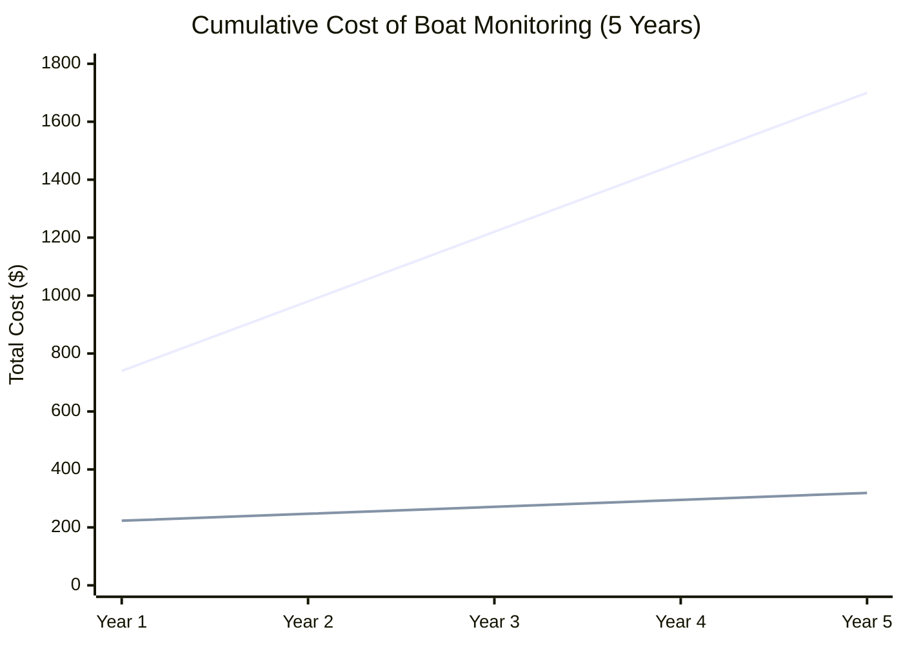
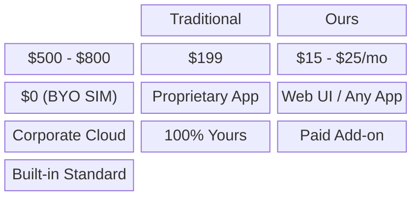
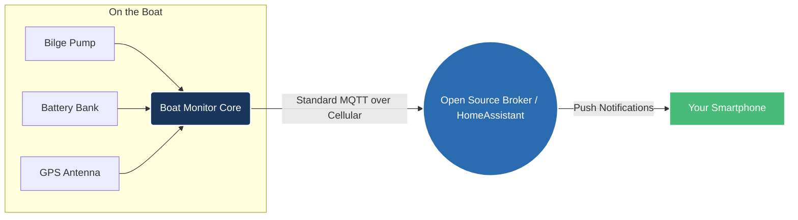

## Data Visualizations & Marketing Assets

This document contains Mermaid charts and mockup graphics to support the marketing and business case for the No-Subscription Boat Monitor.

### 1. The "Marine Tax" Cumulative Cost Comparison

This chart demonstrates the extreme cost disparity over a 5-year ownership period between a traditional subscription-based monitor and the No-Subscription open-hardware approach.

> [!TIP]
> **Use Case:** Perfect for a carousel post on LinkedIn or Instagram to logically justify the purchase to buyers.

*(Assumes Traditional: $500 hardware + $20/mo. Ours: $199 hardware + $2/mo Bring-Your-Own-SIM)*

### 2. Feature Comparison Matrix

### 3. Open System Architecture

This diagram shows how the system securely relays data without relying on a proprietary corporate server that could be shut down.

### Mockup Graphics & Imagery

#### Instagram "POV" Action Shot
Use this to demonstrate the simplicity of checking on the boat from the helm or the dock.

#### Infographic Background Template
Use this blank template to overlay text such as "Stop Paying the Marine Tax" or to drop in the Mermaid charts above for high-quality social posts.

#### System Connectivity Illustration
Use this clean, flat illustration on the website or in a pitch deck to explain how the data flows from the boat to the phone.
