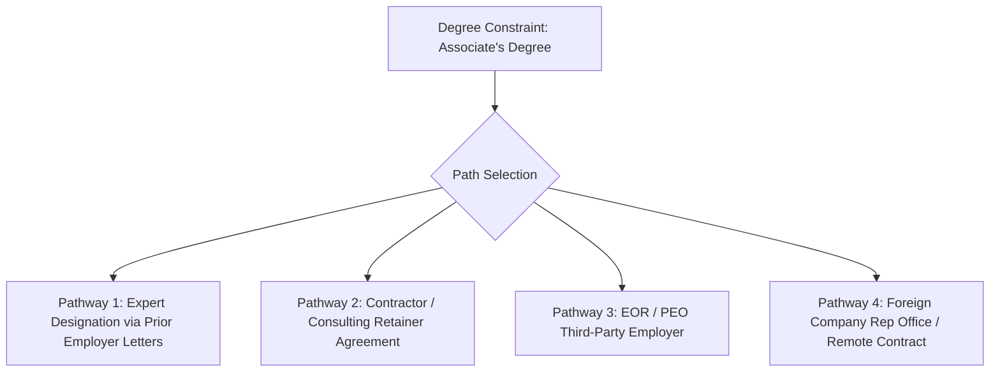
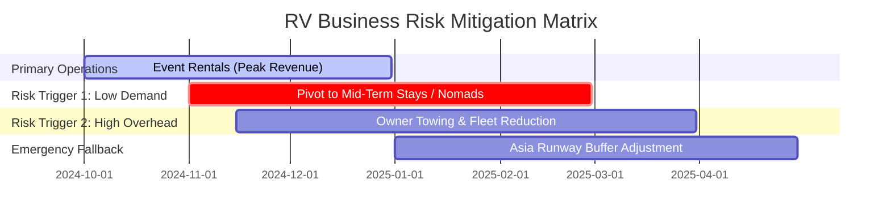
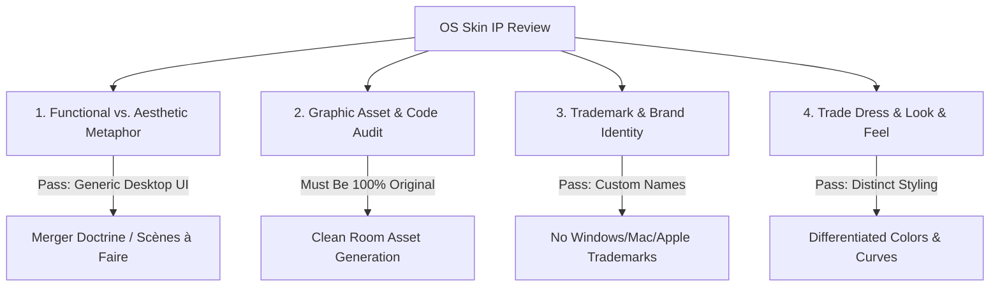
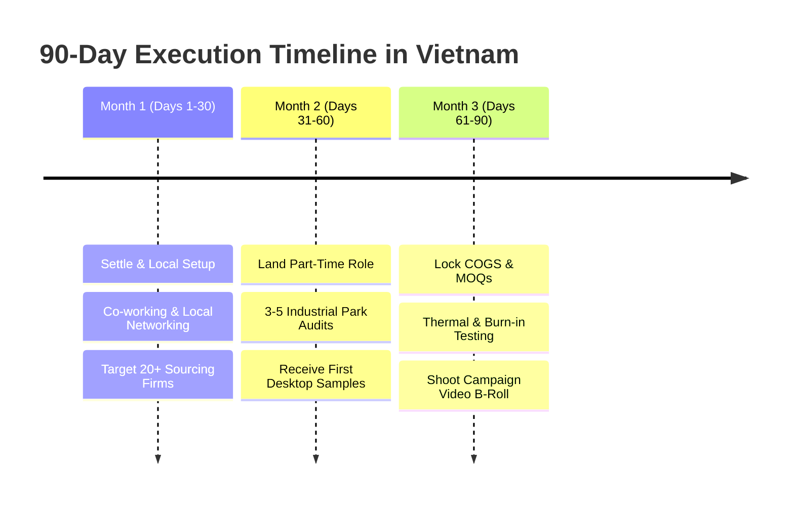

## FOUNDER PROFILE **Name/Background:** Solo entrepreneur, associate's degree (applied arts), US-based **Operating Model:** Digital nomad, willing to relocate anywhere in Asia for opportunity **Philosophy:** Solo until proven fit, comfortable with risk, self-taught operations **Funding Model:** Bootstrapped + family seed funding for specific outsourcing needs **Timeline to Asia:** Q1 2025 (February/March, ideally lea

## founder master strategy

## Omarchy & Asia Relocation: Master Operational Playbook

---

## 1. Top 5 Red Flags When Vetting Suppliers for the Desktop Tier ($140–$165 COGS Target)

When sourcing refurb hardware or barebones Mini-PCs for the $199/$349 tiers, maintaining tight margin integrity and batch quality is non-negotiable. Watch for these 5 critical warning signs:

### Red Flag 1: Component Degradation & Batch Variance ("Lottery" Inventory)
* **The Risk:** Suppliers sourcing refurbished motherboards, SSDs, or RAM often mix grades within a single batch. Unit #1 might test fine, while Unit #50 uses degraded flash memory with high failure rates or thermal throttling under continuous boot cycles.
* **Vetting Action:** 
  * Require a written **Grading Standard Protocol** (e.g., Grade A/A- criteria specifying max cosmetic wear, zero bad sectors on storage, SMART health status >90%).
  * Include a contract clause requiring 100% individual burn-in testing (24-hour MemTest + stress test) before shipment.

### Red Flag 2: MOQ Bait-and-Switch & Hidden Nontariff/License Costs
* **The Risk:** A supplier quotes $140/unit at a 100-unit MOQ to win your interest, but when you place the Kickstarter production order, they claim component prices rose and demand an MOQ of 1,000+ or raise the price to $185/unit.
* **Vetting Action:** 
  * Request a **Tiered MOQ Pricing Matrix** upfront ($140 at 500 units, $135 at 1,000 units, $130 at 2,000 units) backed by a 90-day price lock agreement.
  * Clarify whether quotes include OS license clearance, power supply regional certifications (UL/CE), and packaging.

### Red Flag 3: Lack of Valid Compliance & Safety Certifications (CE, FCC, RoHS)
* **The Risk:** Custom enclosures, power supply units (PSUs), or refurbished mainboards lacking valid FCC/CE/RoHS certifications will be seized at customs (US/EU/Australia) or trigger product liability issues.
* **Vetting Action:** 
  * Request official test reports with lab certificate numbers. Cross-reference certificate numbers on the issuing lab's verification portal to detect forged PDFs.

### Red Flag 4: Resistance to Third-Party Pre-Shipment Inspection (PSI)
* **The Risk:** Suppliers who refuse access to factory floors or third-party quality control agencies (e.g., QIMA, V-Trust) often hide high defect rates or sub-contracting to unvetted workshops.
* **Vetting Action:** 
  * Include the **"Right to Inspect"** clause in all purchase orders: *"Final payment (70%) is contingent upon passing a 3rd-party AQL 2.5 inspection on-site."*

### Red Flag 5: Absence of EOL (End-of-Life) & Spare Parts Commitment
* **The Risk:** Refurbished hardware lines disappear quickly. If a motherboard model goes EOL mid-campaign, you cannot supply identical replacement units for warranty claims or late backers.
* **Vetting Action:** 
  * Require the supplier to guarantee a **3% to 5% buffer of spare parts** (mainboards, power bricks, RAM) dedicated to warranty fulfillment for at least 12 months post-shipment.

---

## 2. Job Search Strategy for Vietnam Sourcing Roles (Accounting for Associate's Degree)

### Navigating Vietnam Work Permit Rules (Decree 152/2020/ND-CP)
Officially, Vietnam work permits for foreign "Experts" require a Bachelor's degree AND 3 years of relevant experience. However, there are 4 legal & operational pathways to secure employment:

1. **Expert Designation via Prior Employer Letters (Recommended):** Decree 152 allows experience letters (showing 3–5 years of operational/sourcing/technical experience certified by foreign companies) to substitute for formal degree requirements in specific technical roles.
2. **Contractor / Freelance Retainer:** Work on a monthly consulting retainer for foreign buying houses or electronics brands. Payments flow to your US/international account while you stay on long-term business/investor visas.
3. **Third-Party Employer of Record (EOR / PEO):** Mid-sized Western supply chain agencies often hire via EOR structures (e.g., Deel, Remote.com) where visa requirements can be handled with specialized job titles.
4. **Foreign Representative Office:** Work for a US/Australian hardware company with a rep office in HCMC.

### Positioning & Resume Framing
* **Title to Target:** *Field Quality Assurance Inspector*, *Supply Chain Operations Associate*, *Vendor Audit Coordinator*, *Hardware Sourcing Specialist*.
* **Value Proposition:** Frame your Applied Arts degree + hands-on solo operations background as **Practical Design for Manufacturing (DFM) & Hardware Execution**.
* **Key Resume Highlights:**
  * Direct experience in rapid prototyping, hardware assembly, and BOM (Bill of Materials) cost breakdown.
  * Willingness to travel extensively to factories in Binh Duong, Dong Nai, and Bac Ninh.
  * Technical literacy in hardware stress testing, QA/QC documentation, and local vendor negotiation.

### Outreach Strategy & Channels
* **Direct Outreach to Western Buying Houses in HCMC & Hanoi:** Target SMEs operating in Vietnam (e.g., dragon-sourcing.com, standardprocurement.com, or hardware startups scaling in SE Asia).
* **LinkedIn Networking Filter:** Search for *Sourcing Director Vietnam*, *Supply Chain Manager Ho Chi Minh*, *Operations Lead Vietnam Electronics*. Send high-intent cold DMs: *"In HCMC Q1 2025; available for field audits & factory QC 25-30 hrs/wk."*
* **Chamber of Commerce Job Boards:** Monitor job listings on AmCham Vietnam (amchamvietnam.com), EuroCham Vietnam, and AusCham Vietnam.

---

## 3. Contingency Plans for RV Rental Business (Q4 2024 Buffer Protection)

To protect your $2,000–$3,000/month runway for the Asia relocation, structure these tiered contingency measures:

### Plan A: Demand Volatility (Events Underperform)
* **Trigger:** Off-season bookings fall below $800/month per rig or event bookings cancel.
* **Pivot Actions:**
  * **Mid-Term Housing Listings:** List rigs on **Furnished Finder** and **Airbnb Mid-Term** (30+ day stays) for traveling nurses, remote tech workers, or temporary corporate relocations near major regional hubs.
  * **Insurance Temporary Housing Partnerships:** Register rigs with insurance placement agencies (e.g., ALE Solutions) as emergency housing replacements for displaced homeowners.
  * **Winery / Agritourism Revenue Share:** Shift from flat nightly fees to a 70/30 revenue share with popular hipcamp/winery hosts to guarantee zero site-fee overhead.

### Plan B: Operational & Maintenance Cost Creep
* **Trigger:** Driver wages ($1,500–$2,000/mo) or tow vehicle repairs erode net margins below $1,500/mo total.
* **Pivot Actions:**
  * **Consolidate Fleet Size:** Hold at **1 or 2 rigs** through Q1 2025 instead of scaling to 3. Preserves cash flow and prevents over-leveraging family/bootstrapped capital.
  * **Owner Towing & On-Site Management:** Temporarily eliminate hired drivers; handle towing and site setup personally while finalizing Kickstarter copy and OS skins.

### Plan C: Cash Runway Preservation for Asia Trip
* **Trigger:** Net RV income falls below $1,500/month going into January 2025.
* **Pivot Actions:**
  * **Remote Freelance Buffer:** Take 10–15 hours/week of remote freelance work (CAD/DFM consulting, Shopify store setup, hardware copywriting) to plug the $1,000/mo shortfall.
  * **Lean Asia Setup:** Lower initial Asia liquid capital buffer requirement from $15,000 to $8,000–$10,000 by staying in serviced coliving spaces (e.g., HCMC District 3 / Phu Nhuand) rather than long-term lease commitments.

---

## 4. IP Review Process for OS Skins: Legal Audit Checklist

Recreating classic operating system UI eras (90s Files & Folders, 2000s Web, Mid-2000s Linux) presents low copyright risk for *functional mechanics*, but high trademark/trade dress risk if aesthetic elements are copied directly.

### What the IP Lawyer Will Check:

#### 1. Functional vs. Aesthetic Metaphors (The Merger Doctrine & Scènes à Faire)
* **What's Safe:** Window management (minimize, maximize, close buttons), taskbars, desktop icons, directory trees, and start menus are functional user-interface paradigms. They cannot be copyrighted.
* **What Lawyer Checks:** Ensuring the underlying windowing manager code uses open-source GUI libraries (e.g., Qt, Electron, GTK, XFCE/Wayland custom skins) without copying proprietary system code.

#### 2. Graphic Asset & Code Audit (Clean-Room Verification)
* **What's Unsafe:** Using actual extracted bitmaps, sound files (boot chimes), icons (e.g., original Windows 95 `My Computer` icon or Apple `Trash` can), or proprietary system fonts (e.g., Tahoma, Segoe UI, Chicago).
* **What Lawyer Checks:**
  * Verification that 100% of icons, cursors, sound effects, and wallpapers are **original vector artwork** or open-source permissive assets (MIT/CC0).
  * Proof of "clean-room" creation process (designers created assets from scratch without tracing proprietary source files).

#### 3. Trademark & Brand Identity Clearance
* **What's Unsafe:** Using registered names like *"Windows"*, *"Win95"*, *"Mac OS"*, *"Aqua"*, *"Finder"*, *"Internet Explorer"*, or brand logos.
* **What Lawyer Checks:**
  * OS skin naming convention audit. Recommended generic names:
    * *90s Era:* **"Omarchy Classic 95"** or **"Workspace 98"**
    * *Early 2000s Web Era:* **"DotCom 2000"** or **"NetSurfer OS"**
    * *Mid-2000s Linux Era:* **"OpenTux 2006"** or **"Penguin Desktop"**

#### 4. Trade Dress & "Look and Feel" Overall Confusion Test
* **What's Unsafe:** A design so visually identical that a consumer could reasonably believe Microsoft, Apple, or Canonical produced or endorsed Omarchy.
* **What Lawyer Checks:**
  * Ensuring color schemes, window border radii, and button shapes have subtle differences (e.g., using 3-stop gradients instead of Apple's exact 2001 gel button spec).
  * Prominent placement of **Omarchy branding** on boot screens and system settings to eliminate buyer confusion.

---

## 5. 90-Day Plan for First 3 Months in Vietnam (HCMC / Hanoi)

### Month 1: Days 1–30 — Arrival, Setup & High-Intent Networking
* **Goal:** Establish local base, secure part-time role pipeline, initiate hardware vendor mapping.
* **Week 1 (Logistics & Base Setup):**
  * Land in HCMC (District 3 or Phu Nhuan) or Hanoi (Tay Ho / Ba Dinh).
  * Acquire local eSIM (Viettel/Vinaphone), open multi-currency account (Wise/Wio), and get monthly pass at local tech co-working space (e.g., Dreamplex, CirCO, or Toong).
* **Week 2 (Job Outreach & Agency Contact):**
  * Submit customized resume & experience portfolio to 20 local supply chain agencies and Western buying houses in Vietnam.
  * Attend local business networking events (AmCham Vietnam Tech Committee, EuroCham Supply Chain Night, hardware founder meetups).
* **Weeks 3–4 (Initial Supplier Discovery):**
  * Visit local electronics wholesale markets (e.g., Nhat Tao Computer Market in HCMC) to inspect component supply chains and refurbish networks.
  * Compile preliminary list of 10 local electronics assembly factories in Binh Duong and Dong Nai industrial zones.

### Month 2: Days 31–60 — Job Landing, Factory Audits & Initial Samples
* **Goal:** Finalize part-time employment/contractor role, inspect supplier factories on-site, receive initial Desktop prototypes.
* **Weeks 5–6 (Role Onboarding & Scheduling):**
  * Finalize contract for 20–30 hr/week sourcing/QC inspection role ($1,200–$1,500/month).
  * Establish structured schedule: **Mon/Wed/Fri = Day Job (Factory audits)** | **Tue/Thu/Sat = Omarchy Execution**.
* **Weeks 7–8 (On-Ground Factory Vetting):**
  * Perform on-site audits of 3 short-listed electronics manufacturers/refurb integrators in Binh Duong / Bac Ninh.
  * Issue RFQ (Request for Quote) for Desktop Standard ($199 tier) and Desktop Premium ($349 tier) with explicit BOM, target COGS ($140–$165), and AQL 2.5 QC standard.
  * Pay for physical sample builds of custom Mini-PC enclosures and refurb motherboards.

### Month 3: Days 61–90 — Sample Teardown, Supplier Lock-In & Video Production
* **Goal:** Lock final COGS & MOQ agreements, validate hardware thermally/functionally, shoot campaign video b-roll inside real factories.
* **Weeks 9–10 (Sample Testing & Teardown):**
  * Receive physical Desktop and TV Maker Kit samples at your Vietnam base.
  * Conduct rigorous burn-in testing (48-hour continuous stress test, thermal throttling analysis, OS era skin responsiveness).
  * Conduct DFM teardown; optimize component selection with factory engineers to shave $10–15 off COGS.
* **Weeks 11–12 (Supplier Lock-In & Kickstarter Assets):**
  * Sign initial **Supplier Agreement & Price Lock** with primary manufacturer (dependent on Kickstarter hitting funding threshold).
  * Hire local freelance videographer ($500–$1,000) to film high-impact Kickstarter video b-roll: on-site factory assembly, hands-on prototype testing, and founder story in Vietnam.
  * Finalize Kickstarter campaign preview link with actual factory quotes and locked shipping rates.

---
*Playbook generated for Omarchy Kickstarter Launch & Asia Relocation Strategy.*

## Assets
- [founder_master_strategy.md](/antigravity/founder-profile-name-background-solo-entrepreneur-associate/founder_master_strategy.md) — MD, 15 KB

Chat transcript — 2 messages, 2026-08-28 → 2026-08-28

**You** · 2026-08-28 20:06

## FOUNDER PROFILE

**Name/Background:** Solo entrepreneur, associate's degree (applied arts), US-based
**Operating Model:** Digital nomad, willing to relocate anywhere in Asia for opportunity
**Philosophy:** Solo until proven fit, comfortable with risk, self-taught operations
**Funding Model:** Bootstrapped + family seed funding for specific outsourcing needs
**Timeline to Asia:** Q1 2025 (February/March, ideally leaving Australia)

---

## PRIMARY PROJECT: OMARCHY (Hardware Kickstarter)

**Campaign:** "Omarchy: The Intergenerational, Glass Box Desktop"
**Concept:** Calm family computer that boots into classic OS eras (90s Files & Folders, 
early-2000s web, mid-2000s Linux). Teaches kids how computers work. Local-first, 
no notifications, no algorithms, parents can co-learn.

**Product Tiers & Pricing:**
1. Digital Builder ($15): Omarchy OS image + build guide PDF
2. Tablet Upcycler ($35): Software license + sticker set + setup guide
3. TV Stick HDMI ($75): Pre-configured HDMI stick + remote + channels
4. TV Maker Kit CRT ($125): SBC + retro enclosure + AV cables + dial remote
5. Desktop Standard ($199): Compact PC + mechanical keyboard + mouse
6. Desktop Premium ($349): Premium desktop + custom keyboard + hardcover guide
7. Resilience Bundle ($425): Premium desktop + mesh antenna + offline library
8. Classroom Multi-Family ($850): 5x desktops + curriculum

**Current Status:**
- Campaign narrative: COMPLETE (detailed copy, FAQ, risk disclosure, asset shot list)
- Sourcing strategy: DRAFTED (specific costs, MOQ, supplier options documented)
- OS development: PROTOTYPE PHASE (functional, needs era skins & refinement)
- Legal review: PENDING (IP review for OS-skin likeness required before launch)
- Campaign timeline: TARGET Q1 2025 launch from Vietnam with on-ground supplier validation

**Sourcing Requirements (COGS Target):**
- Desktop: $140–165 per unit (refurb components or system integrator barebones)
- Tablet: $50–65 per unit (certified refurb iPad/Samsung Galaxy)
- TV (flat-screen): $125–145 per unit (used 1080p TV + Raspberry Pi 4)
- TV (CRT): $80–120 per unit (sourced domestically from e-waste + SBC)
- Kids Device: $90–120 per unit (certified refurb phone + case + warranty)
- Resilience add-on: $45–80 per kit (mesh router + SBC + storage)

**Financial Projections:**
- Target funding: $500K (2,000+ backers)
- Gross margin post-COGS: ~$150K
- Year 1 subscription revenue (estimated 10% adoption, 6-month active): ~$50K
- Year 1 net profit (after overhead): ~$60–80K
- Seed funding needed: $15–25K (video, legal, freelance, contingency)

**Critical Path Items:**
1. Legal IP review (6 weeks before launch)
2. Final supplier quotes & MOQ commitments (8 weeks before launch)
3. Professional video production (5–6 weeks before launch)
4. Copy editing & campaign optimization (4 weeks before launch)
5. Community moderation policy & technical setup (2 weeks before launch)

---

## SECONDARY PROJECTS

**Status:** Foundations being built through end of 2024
**Scope:** Similar hardware Kickstarter concepts (not fully detailed yet)
**Goal:** Validate Omarchy as proof-of-concept, then replicate model for additional products
**Timeline:** Omarchy launch validates model; secondary projects launch 6–12 months after Omarchy

---

## TERTIARY BUSINESS: OFF-GRID RV RENTAL (Revenue Bridge)

**Model:** Purchase custom off-grid RVs (retrofitted tiny homes); rent at premium during 
events or partner with farms/wineries for off-season bookings.

**Revenue Streams:**
- Peak Season (Event Rental): Super Bowl, rodeos, concerts, festivals, Burning Man, 
  conferences, major sporting events
- Off-Season (Farm/Winery Partnerships): Nightly rentals; revenue share with property owner
- Owner Strategy: Camp in tent while RV is rented; semi-delegate to hired drivers for 
  additional units

**Financial Goals:**
- First RV: Purchase December 2024
- Fleet Size by End Q1 2025: 3 RVs operational
- Target Margin per RV: Monthly payment + insurance + fuel + maintenance covered
- Additional Revenue: Owner living expenses + driver salaries for extra rigs
- Purpose: Generate $2,000–3,000/month passive income to fund Asia move + startup work

**Operational Assumptions:**
- Assumes stable event market (no pandemic-like disruptions)
- Assumes drivers available at reasonable cost ($1,500–2,000/month per driver)
- Assumes revenue per RV ~$3,000–4,000/month at peak, $800–1,200/month off-season

---

## ASIA RELOCATION & TRANSITION STRATEGY

**Timeline:**
- Rest of 2024: Build Kickstarter foundations; get RV business operational
- Late January–February 2025: In Australia
- Q1 2025 (February/March): Depart Australia → Asia (Vietnam preferred)

**Location Strategy:**
- PRIMARY: Vietnam (Ho Chi Minh City or Hanoi)
  - Reason: Strongest electronics manufacturing ecosystem; Alibaba supplier concentration; 
    visa flexibility; low cost of living; expat founder community
  - Alternative: Thailand (Bangkok), Philippines (Manila) if visa/opportunities require
  - Willingness: Open to anywhere in Asia/India if opportunity warrants

**Employment in Asia:**
- Role: Part-time (25–35 hours/week) in quality control / operations / sourcing capacity
- Employer Type: Export company, electronics manufacturer, supply chain firm, third-party 
  inspection service
- Salary Target: $1,200–2,500/month
- Visa Sponsorship: Needed (work permit officially requires bachelor's degree in Vietnam; 
  negotiable with employer or via contractor arrangement)
- Advantage: Puts founder directly in manufacturing ecosystem; builds supplier relationships; 
  provides legitimacy for factory access

**Parallel Startup Work (20–30 hours/week):**
- Primary: Omarchy sourcing, factory visits, supplier negotiations, design validation
- Secondary: Secondary Kickstarter project development
- Goal: Lock in supplier pricing & relationships by Month 6 in-country for Kickstarter launch

**Financial Architecture in Asia:**
- RV business passive revenue: ~$2,000–3,000/month covers personal expenses + project costs
- Day job salary: ~$1,500/month covers additional buffer + operational costs
- Combined: ~$3,500–4,500/month runway = 2–3 years pre-launch sustainability
- Allows Omarchy to launch with on-ground supplier validation + real cost data

---

## DECISION-MAKING FRAMEWORK

**Solo Until Proven:**
- No co-founders or full-time hires until post-Kickstarter launch
- Freelancers/contractors for specific outsourced work (video, legal, copy, accounting)
- Family seed funding for campaign production, not operational salaries

**What Founder Does Personally:**
1. OS development & technical vision (non-negotiable)
2. Product demos & video recording (credibility asset)
3. Supplier relationship building (ownership required)
4. Financial modeling & metrics (understand the business cold)
5. Community engagement (first 4 weeks post-launch)

**What Gets Outsourced:**
1. Video production (professional grade) — $5–8K
2. Copy editing & campaign refinement — $500–1,500
3. Legal IP review — $2K
4. Accounting setup — $500–1,500
5. Community moderation (post-launch) — $500/month
6. Tactical Kickstarter strategy review (optional) — $1,500–2K

---

## KEY CONSTRAINTS & UNKNOWNS

**Constraints:**
- Associate's degree (no bachelor's) — framed as supply chain knowledge + Kickstarter credibility
- Limited startup execution experience — but strong conceptual understanding
- Solo operation — speed asset, but requires outsourcing for parallel work
- Loose capital ($15–25K seed) — must prioritize ruthlessly

**Unknowns / Risks:**
1. IP/trademark viability of OS-skin recreation (legal review TBD)
2. Community content moderation scalability (policy TBD)
3. Actual supplier lead times & MOQ negotiations (samples pending)
4. Backer satisfaction with refurbished components (unknown until post-campaign)
5. RV business revenue volatility (event market assumptions may not hold)
6. Visa sponsorship ease in Vietnam (varies by employer)

---

## YOUR GOALS (Next 1–2 Years)

**Short-term (Q1 2025 onward):**
- Land part-time sourcing/ops role in Vietnam
- Finalize Omarchy supplier quotes & relationships
- Launch Kickstarter (Q1–Q2 2025)
- Oversee Omarchy fulfillment from Vietnam base

**Medium-term (Months 12–18):**
- Omarchy reaches profitability post-fulfillment
- Secondary Kickstarter concept validated
- RV business stabilized with 3+ units + hired drivers
- Establish 2–3 long-term supplier partnerships for future projects

**Long-term (2+ years):**
- Build business that creates jobs & helps people (unspecified concept)
- Sustain comfortable living from multiple revenue streams
- Position for Series A funding if growth warrants
- Expand to additional hardware products or adjacent markets

---

## HOW TO USE ME

**I can help with:**
- Sourcing strategy (supplier vetting, negotiation scripts, MOQ traps, quality assurance)
- Kickstarter campaign optimization (messaging, tier design, risk disclosure, community setup)
- Asia transition planning (visa strategy, job search, relocation logistics)
- Financial modeling (unit economics, break-even, cash flow projections)
- Operational scaling (hiring, delegation, offshore team coordination)
- Product development advice (feature prioritization, design direction, user testing)
- Risk mitigation (legal, compliance, supply chain contingency planning)

**Ask me specific questions like:**
- "What questions should I ask suppliers about MOQs to avoid getting trapped?"
- "How should I position my associate's degree in a job application for a Vietnam sourcing role?"
- "What's the realistic timeline from supplier commitment to first units arriving?"
- "How should I structure the community channel moderation policy for legal safety?"
- "Should I launch Omarchy before or after secondary project validation?"

**Provide feedback & context:**
- Share updates as things progress (suppliers respond, financing closes, decisions finalize)
- Tell me when my advice doesn't match your situation (I'll adjust)
- Alert me to new constraints or opportunities (visa denials, unexpected expenses, market shifts)

---

## SESSION NOTES

- This prompt is comprehensive but not exhaustive. Update it as plans evolve.
- Founder is action-biased, prefers concrete tactics over theory.
- Timeline is tight but realistic (6 months to Asia launch).
- Financial runway is achievable but depends on RV business delivering on projections.
- Key assumption: Vietnam relocation is feasible and timing aligns with Australia→Asia travel.

---

*Follow up questions: "What are the top 5 red flags I should watch for when vetting suppliers for the Desktop tier?"
"Create a job search strategy for Vietnam sourcing roles, accounting for my associate's degree"
"What contingency plans should I have if the RV business underperforms in Q4 2024?"
"Walk me through the IP review process for the OS skins—what exactly will a lawyer check?"
"Give me a 90-day plan for my first 3 months in Vietnam"

---

**Antigravity** · 2026-08-28 20:06

I have synthesized your profile, primary project (**Omarchy**), revenue bridge (**RV Rental Business**), and Asia transition strategy into a comprehensive operational document:

📄 **[founder_master_strategy.md](file://[local path redacted])**

---

### Executive Summary of Key Playbook Strategies

1. **Desktop Tier Supplier Vetting ($140–$165 COGS Target)**
   - **Batch Variance & "Lottery" Refurbs:** Require a written Grading Standard Protocol (Grade A/A- criteria, zero bad sectors, SMART health >90%) and a mandatory 24-hr burn-in test contract clause.
   - **MOQ & Compliance:** Secure 90-day tiered MOQ price locks upfront and verify FCC/CE/RoHS lab certificate numbers directly on issuing portals. Always include a 3rd-party AQL 2.5 Pre-Shipment Inspection (PSI) clause before releasing the final 70% payment.

2. **Vietnam Sourcing Job Search Strategy (Associate's Degree Framing)**
   - **Visa Compliance (Decree 152):** Frame your 3–5 years of practical solo operations/hardware execution to obtain an **Expert Designation via Prior Employer Letters**. Alternative pathways include foreign contractor retainers, Employer of Record (EOR) hiring, or foreign representative office roles.
   - **Role Targets:** Target *Field QA/QC Inspector*, *Vendor Audit Coordinator*, or *Hardware Sourcing Specialist* across Western buying houses, SME hardware brands, and recruitment agencies (Robert Walters, Navigos) in HCMC/Hanoi.

3. **RV Rental Business Q4 2024 Contingency Plans**
   - **Demand Slump:** Pivot from event rentals to 30+ day mid-term stays on Furnished Finder (traveling nurses, remote workers) or temporary housing replacement placements via insurance partners.
   - **Margin Creep:** Hold fleet expansion at 1–2 units (instead of 3) and temporarily eliminate hired driver costs by handling towing personally to preserve your $2,000–$3,000/mo Asia runway.

4. **OS Skins IP Legal Audit Process**
   - **What's Protected vs. Safe:** Functional UI paradigms (minimizing windows, taskbars, folder trees) are uncopyrightable under the *Merger Doctrine*.
   - **Lawyer's Checklist:** Verify 100% clean-room generated vector icons/sounds (no extracted proprietary bitmaps/audio/fonts), audit skin names to avoid brand trademarks (e.g., use *"Classic 95"* instead of *"Windows 95"*), and test overall trade dress to ensure zero consumer confusion with legacy operating systems.

5. **90-Day Plan for Vietnam Arrival (Q1 2025)**
   - **Days 1–30:** Base setup in HCMC/Hanoi, apply to 20+ sourcing agencies, map industrial zone suppliers in Binh Duong/Dong Nai.
   - **Days 31–60:** Land 20–30 hr/wk sourcing role, conduct on-site factory audits, issue RFQs for physical sample builds.
   - **Days 61–90:** Conduct sample stress tests/DFM teardowns, lock in primary supplier COGS & MOQs, and capture factory assembly b-roll for your Kickstarter campaign video.

---

### Recommended Next Steps & Slash Commands

- Explore the full breakdown in **[founder_master_strategy.md](file://[local path redacted])**.
- If you'd like to refine specific supplier negotiation scripts, draft cold emails for Vietnam sourcing roles, or outline the Kickstarter campaign video storyboard, let me know!
- You can also use the `/grill-me` command to do a deep-dive interactive alignment on any specific tier or workflow.

---

*Imported from Antigravity conversation `5c53b548-fde9-44f2-b22f-7ac0fc1ff06a` — 6 recorded steps, 1 tool actions, 1 context checkpoints (earlier turns were truncated by Antigravity). Source: `antigravity`.*
