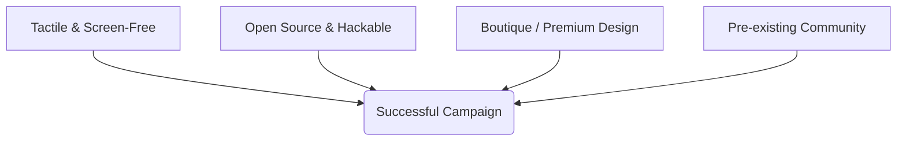

## Market Analysis & Kickstarter Blueprint: Music Hardware (Synths, MIDI, Pedals)

This analysis evaluates the current market landscape for synthesizers, MIDI controllers, and guitar pedals, focusing on the intersection of **open-source hardware (OSHW)** and **crowdfunding success**. It outlines what makes hardware projects successful on Kickstarter and presents four product concepts designed for crowdfunding campaigns.

## 1. Market Landscape & Crowdfunding Success Factors

Crowdfunding platforms (specifically Kickstarter and Indiegogo) have democratized music technology by allowing boutique developers to bypass traditional venture capital and retail channels. Successful campaigns in this space tend to succeed based on **aesthetic appeal, community ownership, and structural hackability**.

### Key Trends & Case Studies



1. **CHOMPI Sampler (2023 - $1M+ raised):**
   * **The Hook:** A chromatic sampler/looper designed with a "cute" (kawaii) aesthetic, mechanical keyboard keys, and a completely screenless workflow.
   * **Technology:** Built entirely on the open-source **Electro-Smith Daisy Seed** DSP platform.
   * **Why it worked:** It combined highly professional DSP code with a playful, accessible interface that stood out in a sea of sterile black and grey music gear.

2. **Tembo (2026 - $2.0M+ raised):**
   * **The Hook:** A screen-free, grid-based hardware sequencer using physical magnetic chips to trigger steps and modulation.
   * **Why it worked:** Heavy focus on tactile and physical interactions. In an era of screen fatigue, musicians crave hardware that feels physical and interactive.

3. **OnePedal (2026 - $200k+ raised):**
   * **The Hook:** An AI-powered guitar pedal capable of capturing and recreating the tone of any amplifier or pedal using a mobile app.
   * **Technology:** Neural network DSP.
   * **Why it worked:** Tackled a huge trend (neural profiling) and condensed it into an accessible, single-enclosure stompmbox format.

4. **Timepod (2025 - $73k raised):**
   * **The Hook:** A dedicated MIDI controller with 16 high-resolution endless encoders and a firmware-level preset-snapshot system.
   * **Why it worked:** It solved a specific workflow problem for DAW users who want high-quality tactile control without complex mapping interfaces.

## 2. Existing Open Source Hardware Platforms

Leveraging existing open-source hardware frameworks reduces development time, guarantees class-compliance, and allows campaigns to offer both **pre-built units** and **DIY kits** to attract multiple tiers of backers.

| Platform | Core Processor | Best Suited For | Key Open Source Ecosystem |
| :--- | :--- | :--- | :--- |
| **Electro-Smith Daisy Seed** | ARM Cortex-M7 (480MHz) | Guitar pedals, Eurorack modules, mono/poly desktop synths. | PedalPCB Terrarium, GuitarML, Synthux Academy |
| **PJRC Teensy 4.1** | ARM Cortex-M7 (600MHz) | Handheld sequencers, polyphonic synths, dense MIDI controllers. | Teensy Audio Library, Dirtywave M8 Headless |
| **Raspberry Pi (Zero 2W / CM4 / CM5)** | Quad-core ARM Cortex | Multipurpose workstations, touchscreens, Linux host synths. | Zynthian, Monome Norns Shield, MiniDexed |
| **Raspberry Pi RP2040 / Pico** | Dual ARM Cortex-M0+ | MIDI controllers, capacitive touch interfaces, simple DSP. | OpenDeck, Control Surface Library |

## 3. Product Opportunities for Kickstarter

The following four concepts leverage open-source foundations, target current market gaps, and are optimized for the Kickstarter demographic.

## 4. Crowdfunding Execution Roadmap

If you decide to move forward with one of these projects, use the following operational roadmap to prepare the campaign:

```
[Month 1-3: Prototyping] ---> [Month 4-5: Community & List Building] ---> [Month 6: Campaign Launch] ---> [Month 7-12: Manufacturing & Shipping]
```

### Stage 1: Design & Validate (Months 1–3)
1. **BOM Optimization:** Use readily available parts. The Daisy Seed or Teensy 4.1 should act as the brain to minimize layout design risks.
2. **Industrial Design:** Use high-quality render models and 3D print cases to test physical ergonomics.
3. **Firmware Proof of Concept:** Write the basic audio engine and ensure latency is sub-10ms.

### Stage 2: Pre-Launch Marketing (Months 4–5)
1. **Build a Landing Page:** Collect email addresses by promising early-bird discounts.
2. **Community Infiltration:** Post build logs on **r/synthdiy**, the **Elektronauts** forum, **Mod Wiggler**, and **PedalPCB forums**. Show working prototypes, not just mockups.
3. **Send Prototypes to Influencers:** Build 5–10 beta units and send them to niche YouTubers (e.g., *Loopop*, *Cuckoo*, *Benn Jordan*, or *Knobs* for pedals) to ensure day-one video coverage.

### Stage 3: Campaign Launch (Month 6)
* Set a realistic funding goal that covers the minimum order quantity (MOQ) for PCBs and custom enclosures (typically $20,000–$30,000).
* Offer a **DIY Kit Tier** (PCB + pre-programmed chip) alongside the **Assembled Retail Tier** to lower the entry price point.

### Stage 4: Production & Fulfillment (Months 7–12)
* Partner with a turn-key manufacturer (like PCBA houses in Shenzhen or local assembly houses) to avoid manual soldering of thousands of units.
* Maintain bi-weekly, transparent updates on Kickstarter, sharing both manufacturing wins and unforeseen bottlenecks.

## voxel stomp product spec

## Product Specification: Voxel Stomp

Voxel Stomp is a hybrid guitar pedal and desktop performance instrument that combines state-of-the-art **Neural Amp Modeling (NAM)** with an expressive **sound-on-sound tape looper**. Designed in a premium wedge-shaped enclosure with solid wood cheeks, it features two heavy-duty footswitches for hands-free play and a 1-octave mechanical key layout on the face for desktop sound manipulation.

## 1. System Architecture

Voxel Stomp utilizes a **Dual-MCU Architecture** to guarantee zero-latency audio performance and glitch-free UI updates.

*   **Daisy Seed (STM32H753):** Dedicated exclusively to high-fidelity audio DSP, running the RTNeural engine and the looper audio buffers.
*   **RP2040:** Dedicated to UI tasks, including mechanical key scanning, OLED screen rendering, LED animations, and serial communication.

### Block Diagram

```mermaid
graph TD
    %% Inputs
    AudioIn[

## Related

- [ipod midi osc touchpad connection](/projects/build-a-midi-touch-pad-connection-from-an-ipod/)
- [building a react testbed for the byo sim boat monitor](/projects/build-a-testing-application-for-the-byo-sim-boat/)
