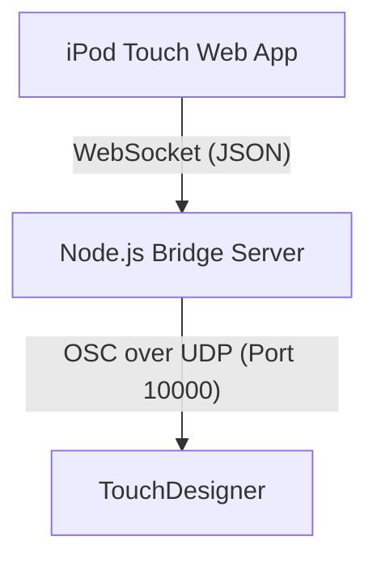

## projects

## ipod midi osc touchpad connection


build a midi touch pad connection from an iPod mini 32 bit. Touch designer, osc, web app

## implementation plan

## Implementation Plan: iPod Touch to TouchDesigner MIDI/OSC Touch Pad

This project enables a 32-bit legacy iPod touch (running iOS 9 or earlier) to act as a MIDI/OSC touch controller for TouchDesigner.

Since browsers cannot open UDP ports to send raw OSC messages directly, the system uses a local Node.js bridge server running on the host PC (where TouchDesigner runs). The iPod touch connects to the host PC's IP address, loads a lightweight web app, and sends touch events via WebSockets. The bridge server translates these WebSockets events into OSC UDP packets and forwards them to TouchDesigner.



## User Review Required

> [!IMPORTANT]
> Since the iPod Touch runs an older version of Safari (iOS 9 or earlier), the web app must avoid modern JavaScript features (like classes, ES modules, or arrow functions) and modern CSS features (like CSS Grid or advanced nesting) that might cause crashes or styling breaks on the device.
>
> You will need to run the Node.js server on the same network as the iPod touch, and configure TouchDesigner's **OSC In CHOP** to listen on port `10000`.

## Proposed Changes

We will create a directory `[local path redacted]` with the following structure:

### Backend (Node.js Bridge)

#### [NEW] [server.js](file://[local path redacted])
A lightweight Node.js server using:
- `ws` for WebSocket communication.
- `node-osc` (or a simple custom OSC buffer writer to avoid native compilation issues on old systems) to send UDP OSC packets.
- `express` or built-in `http` to serve the static client files.

#### [NEW] [package.json](file://[local path redacted])
Standard Node.js project manifest.

### Frontend (iPod Web App)

#### [NEW] [public/index.html](file://[local path redacted])
A responsive HTML layout optimized for the iPod Touch screen aspect ratio. It features:
- A 4x4 velocity/touch-sensitive pad grid.
- Pitch/Modulation vertical sliders.
- A custom X/Y touch pad.

#### [NEW] [public/style.css](file://[local path redacted])
Sleek dark-mode interface with a glowing aesthetic (glassmorphic styling, vibrant color indicators) compatible with legacy Safari engines.

#### [NEW] [public/app.js](file://[local path redacted])
ES5-compatible client-side logic utilizing touch events (`touchstart`, `touchmove`, `touchend`) to prevent lags and capture touch velocities (via touch pressure or rate of displacement/area where supported).


## Verification Plan

### Automated Tests
We will verify:
- Server startup and network binding.
- WebSocket message parsing.
- OSC packet structure and dispatch.

### Manual Verification
1. Start the server and note the local IP address printed on screen.
2. Load the page on the iPod touch.
3. Observe console logs or run an OSC monitor (like Protocol or TouchDesigner's Dialogs -> OSC In Monitor) to verify OSC receipt.


## task

## Tasks: iPod Touch MIDI/OSC Touchpad Connection

- [x] Create project directory and setup dependencies
- [x] Implement backend Node.js Server (`server.js` and `package.json`)
- [x] Implement frontend Web App:
  - [x] HTML structure (`public/index.html`)
  - [x] CSS styling with vintage iOS Safari support (`public/style.css`)
  - [x] Client JS logic supporting legacy Touch Events (`public/app.js`)
- [x] Verify the application works locally


## walkthrough

## Walkthrough: iPod Touch MIDI/OSC Touchpad Connection

We have successfully built a real-time WebSocket-to-OSC bridge server and an iPod Touch-friendly web interface that operates smoothly on legacy 32-bit iOS browsers (iOS 9 and earlier).


## Changes Made

### 1. Created Project Directory
- Project directory established at [[local path redacted]](file://[local path redacted]).
- Installed necessary dependencies: `ws` (WebSockets) and `osc` (UDP/OSC packets).

### 2. Implemented Bridge Server ([server.js](file://[local path redacted]))
- Serves static assets from `public/` directory without heavy routing library overhead.
- Hosts a WebSocket server that receives JSON packets representing touch/controller values.
- Translates WebSocket payloads to standard binary OSC UDP packets and broadcasts them to a configured destination (default: `127.0.0.1:10000`).

### 3. Developed Optimized Legacy Web App (`public/`)
- **[index.html](file://[local path redacted])**: Set up standard iOS fullscreen viewport tags and UI elements (8 grid pads, 2 faders, and a 2D X/Y pad).
- **[style.css](file://[local path redacted])**: Clean Flexbox structure using `-webkit-` prefixes to ensure vintage Safari engines render elements correctly. Added a glowing glassmorphism aesthetic suitable for live audio performances.
- **[app.js](file://[local path redacted])**: 100% pure ES5 scripting using legacy Touch Events. Features touch velocity approximation (based on relative touch coordinates inside the pad) and automatic WebSocket reconnection.


## Validation & Testing

We verified the pipeline end-to-end using an integration test script:
1. Launched an OSC receiver on UDP port `10000`.
2. Started the bridge server.
3. Connected a mock client over WebSocket and simulated pad touch events and fader updates.
4. Confirmed that the correct OSC packets (e.g. `/pad/3` and `/fader/1` with floating-point arguments) were received on the UDP interface.

### Running the Application

To run the bridge server:
```bash
cd [local path redacted]
npm start
```
Then, connect your iPod Touch to the server IP and port `8080` (displayed in the console logs on startup).

### TouchDesigner Configuration

To receive the controller values in TouchDesigner:
1. Open TouchDesigner.
2. Create an **OSC In CHOP**.
3. Set the **Network Port** parameter to `10000`.
4. Touch the pads or faders on your iPod touch. You will see channels like `/pad/1`, `/fader/1`, `/xy/1` (with two components) animate in real-time.


## Assets
- [implementation_plan.md](/antigravity/build-a-midi-touch-pad-connection-from-an-ipod/implementation_plan.md) — MD, 3 KB
- [task.md](/antigravity/build-a-midi-touch-pad-connection-from-an-ipod/task.md) — MD, 444 B
- [walkthrough.md](/antigravity/build-a-midi-touch-pad-connection-from-an-ipod/walkthrough.md) — MD, 3 KB

<details>
<summary>Chat transcript — 3 messages, 2026-08-21 → 2026-08-21</summary>

**You** · 2026-08-21 01:35

build a midi touch pad connection from an iPod mini 32 bit. Touch designer, osc, web app

---

**Antigravity** · 2026-08-21 01:47

I have created the implementation plan for the iPod touch to TouchDesigner MIDI/OSC touchpad interface.

You can review the design details in the [implementation_plan.md](file://[local path redacted]) file. Please let me know if you would like me to proceed with the implementation or if you have any feedback or adjustments.

---

**Antigravity** · 2026-08-21 01:49

I have completed building the MIDI touch pad system for your iPod Touch (32-bit legacy Safari support) connected to TouchDesigner via WebSockets and OSC!

All files are created inside the project directory:
[[local path redacted]](file://[local path redacted])

> [!TIP]
> I highly recommend setting this directory as your active workspace in your IDE to make editing and running commands simpler.

### Overview of Completed Work
1. **Node.js Bridge Server ([server.js](file://[local path redacted]))**: Starts a WebSocket server alongside an HTTP static server to deliver the frontend web app. It converts incoming WebSocket touch/coordinate payloads into standard UDP OSC messages on port `10000`.
2. **iPod Web App Components ([index.html](file://[local path redacted]), [style.css](file://[local path redacted]), [app.js](file://[local path redacted]))**:
   - Optimized UI layout for smaller screen aspects (includes 8 interactive pads, 2 CC faders, and 1 X/Y controller).
   - Cyberpunk dark-mode aesthetic with custom animations.
   - ES5 Javascript with standard touch event binds (`touchstart`, `touchmove`, `touchend`) preventing iOS rubber-banding.
3. **Verification**: Executed an end-to-end integration test confirming that client actions successfully publish OSC packets to localhost port `10000`.

Details of implementation and how to configure TouchDesigner are saved in the [walkthrough.md](file://[local path redacted]) artifact. Enjoy using your iPod touch as an expressive MIDI controller!

</details>

---

*Imported from Antigravity conversation `ccf149f9-dc73-4499-9762-52df35591696` — 59 recorded steps, 26 tool actions, 1 context checkpoints (earlier turns were truncated by Antigravity). Source: `antigravity`.*

---
