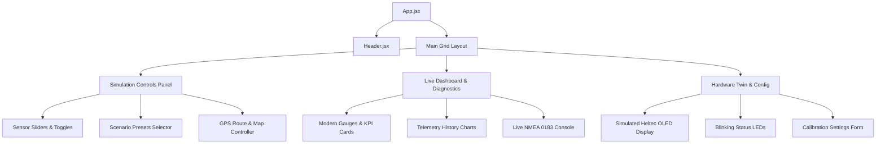

build a testing application for the BYO sim boat monitor. Designing the front end application layout with simulated inputs to test functionality.

## implementation plan

## Implementation Plan: Interactive Simulator & Testbed for BYO Sim Boat Monitor (BilgeGuard)

This plan outlines the architecture and implementation steps to build a high-fidelity, premium interactive testing application for the **BYO Sim Boat Monitor**. This dashboard will act as a "digital twin" of the ESP32-based hardware (BilgeGuard/LoRa Boat Monitor), allowing developers and users to simulate sensor inputs, trigger alarm scenarios, visualize telemetry on interactive gauges/maps, calibrate sensors, and inspect raw NMEA/LoRa/Ubidots payloads.

## User Review Required

> [!IMPORTANT]
> The application will be built as a standalone **React + Vite** SPA in `[local path redacted]`. 
> Since there is no active workspace, we recommend configuring `[local path redacted]` as the active workspace after initialization.

> [!TIP]
> The application is styled using **Vanilla CSS (or styled-components / CSS variables)** with custom animations, glassmorphism card panels, and interactive elements to provide a state-of-the-art developer and testing experience.

---

## Open Questions
*No open questions at this stage. The requirements are fully mapped based on the existing C++ code and hardware specifications.*

---

## Proposed Changes

We will create a new React + Vite project in the scratch directory. The codebase will consist of the following structure:

### Component Architecture



### New Project Structure

#### [NEW] [index.html](file://[local path redacted])
The HTML entrypoint, configured to load the React app and load premium typography (`Outfit` and `JetBrains Mono` from Google Fonts).

#### [NEW] [src/index.css](file://[local path redacted])
The core design system containing custom CSS tokens, modern styling (glassmorphism backdrops, glow effects, custom scrollbars, layout helpers), and animations.

#### [NEW] [src/App.jsx](file://[local path redacted])
The main controller. Holds state for all simulated hardware parameters:
- **Battery**: raw ADC voltage, calibrated voltage, battery capacity.
- **Float Switch**: bilge state (Normal/Alarm), run counter.
- **Tanks 1 & 2**: raw resistance (ohms), analog voltage, calculated percentage.
- **Temperatures**: DS18B20 (Engine, Fridge, Battery), BME280 (Cabin Temp, Dewpoint).
- **Environment**: Humidity, Pressure.
- **GPS**: Lat, Lon, Alt, Speed, Course, Satellite lock, simulated route step.
- **Victron**: Panel voltage, battery current, temp, charge state.
- **Relay**: Active state, timer countdown.
- **Calibration Settings**: `a1vslope`, `a2vslope`, `voffset`, `t1offset`, `a1t1slope`, `a2t1slope`, `t2offset`, `a1t2slope`, `a2t2slope`.

#### [NEW] [src/components/SimulationControls.jsx](file://[local path redacted])
Contains input controls:
- **Sliders & Toggles**: Interactive inputs for all parameters.
- **Scenario Presets**:
  - `Normal Anchored`: Calm weather, stable 12.6V, bilge inactive.
  - `Engine Running / Charging`: Engine temp 82°C, battery voltage 14.1V, alternator charge indicator.
  - `Severe Storm / Leak`: Low barometric pressure (980mbar), 99% humidity, bilge alarm active (triggering blinking sirens).
  - `Solar Charging`: Victron active (18V solar, 5.2A current, 88% SoC).
  - `Sailing Trip`: Toggles GPS auto-navigation, which moves the boat along a simulated path, generating speed/bearing changes.
- **Interactive Map**: A lightweight visual map widget showing the boat moving.

#### [NEW] [src/components/OLEDDisplay.jsx](file://[local path redacted])
A pixel-perfect simulation of the Heltec WiFi LoRa 32 V2 OLED display. It renders the device's diagnostic screens:
- **Booting Screen**: Animation of ESP32 boot, sensor initialization, and network join.
- **Live Diagnostics Screen**: Renders text values (e.g., `V: 12.82V`, `T1: 45%`, `B: OK`, `T: 22.4C`, `GPS: Fix`) matching the layout generated by the C++ firmware.
- **Transmission Frame**: Periodically blinks "LoRa TX..." or "LTE-M Join..." when sending data.

#### [NEW] [src/components/TelemetryGauges.jsx](file://[local path redacted])
Renders modern, premium KPI cards and gauges:
- **Battery Gauge**: Radial ring changing color from green to orange/red as battery drains.
- **Bilge Guard Status**: An urgent visual indicator that flashes red during a bilge alarm.
- **Water & Fuel Tanks**: Dynamic liquid-fill meters.
- **Solar Charge Monitor**: Renders a clean charging card displaying Victron VE.Direct data.

#### [NEW] [src/components/NMEADiagnostics.jsx](file://[local path redacted])
Displays:
- **NMEA 0183 Output**: Real-time generation and display of standard marine strings:
  - `$GPRMC` (Position, Speed, Course, Time)
  - `$WIMDA` (Meteorological data: temp, pressure, humidity)
  - `$GPZDA` (UTC Date/Time)
- **JSON Telemetry Payload**: A toggle to show the raw JSON payload produced by `/json` that matches the ESP32 server output format.

---

## Verification Plan

### Automated Tests
- Validate that the code compiles successfully under Vite (`npm run build`).

### Manual Verification
- We will launch the Vite development server using `npm run dev`.
- Using a browser subagent, we will navigate to the simulator and verify:
  1. Setting the battery voltage slider to `< 11.0V` triggers a "Low Battery" warning card and changes the OLED status.
  2. Activating the Bilge Switch toggle triggers a flashing red alarm state and flashes the simulated physical alarm LED.
  3. Clicking the `Sailing Trip` scenario auto-generates shifting latitude/longitude coordinates and outputs live NMEA `$GPRMC` sentences.
  4. Updating calibration settings recalculates tank percentage display correctly.

## task

## Task Checklist: BYO Sim Boat Monitor Interactive Testbed

- [x] Initialize the React + Vite project in `[local path redacted]`
- [x] Install base dependencies (`lucide-react` for premium icons)
- [x] Configure `index.html` and design tokens in `src/index.css` (Glassmorphism, Outfit font, dark theme, smooth animations)
- [x] Implement simulation state management in `src/App.jsx`
- [x] Build the physical hardware mockup component (`src/components/OLEDDisplay.jsx`)
- [x] Build the interactive controls panel (`src/components/SimulationControls.jsx` including preset triggers and Leaflet-like simulated map)
- [x] Build the telemetry gauges and live solar monitor (`src/components/TelemetryGauges.jsx`)
- [x] Build the NMEA 0183 & JSON terminal console (`src/components/NMEADiagnostics.jsx`)
- [x] Run the Vite build and verify correct compiling
- [x] Test the application live (Vite server running on localhost:5174; browser subagent encountered environment Playwright download issue, user notified)
- [x] Redesign layout for End-User Mobile Application UI Mockup (with wave animations, tabs, status bar, and cockpit split layout)
- [x] Create second workspace `/scratch/sim-boat-monitor-devbed` containing original 3-column developer layout (running on port 5175)

## walkthrough

## Walkthrough: Dual-workspace Testbeds for BYO Sim Boat Monitor

We have set up two separate workspaces in `[local path redacted]` containing both the end-user application layout and the developer verification layout. Both compile successfully under Vite and run in the background concurrently.

---

## 1. Workspace 1: End-User Application Setup
* **Path**: [`[local path redacted]`](file://[local path redacted])
* **Local Port**: **`http://localhost:5174/`**
* **Concept**: Designed for the final yacht owner mobile app UI.
* **Layout**:
  * **Simulation Cockpit (Left)**: Inputs, raw sliders, GPS lock, Wi-Fi toggles, presets.
  * **Physical ESP32 Twin (Left)**: Renders the Heltec board with the monochrome OLED.
  * **Smartphone Bezel Mockup (Center/Right)**: Encloses the mobile app UI.
    * **Tab 1 (Dashboard)**: Features a water intrusion red header, battery Dial gauge, Victron solar charges, environmental metrics, and fuel/water tanks with **CSS fluid wave animations**.
    * **Tab 2 (Chart Map)**: Click-to-move Leaflet map and auto-sailing coordinates tracker.
    * **Tab 3 (Terminal)**: Developer logs, live NMEA feed, and mock `/json` REST responses.

---

## 2. Workspace 2: Developer Diagnostics Setup (Original Layout)
* **Path**: [`[local path redacted]`](file://[local path redacted])
* **Local Port**: **`http://localhost:5175/`**
* **Concept**: Full-screen developer diagnostic cockpit.
* **Layout**:
  * **Cockpit controls (Left Column)**: Sliders for battery, tanks, weather, and a canvas map inside tabs.
  * **Diagnostics & Dials (Center Column)**: Large battery SVG gauge, solar chargers, and a full-size NMEA log feed console card.
  * **Hardware Twin (Right Column)**: Page-cycling monochrome OLED physical board simulation, LEDs, and calibration settings panel.

---

## Scroll Jump Bug Fix (Applied to both layouts)
* **Issue**: Changing inputs triggered new NMEA log entries, causing the terminal's `scrollIntoView()` function to execute. This was shifting the browser window scroll position and jumping the entire page viewport.
* **Solution**: Replaced `scrollIntoView()` on a hidden div with a **local container scroll offset**. The console body elements now run a local ref effect:
  ```javascript
  useEffect(() => {
    if (consoleBodyRef.current) {
      consoleBodyRef.current.scrollTop = consoleBodyRef.current.scrollHeight;
    }
  }, [logs]);
  ```
  This scrolls only the console viewport locally, leaving the main browser window scroll position completely stable during slider actions and scenario changes.

---

## Simulated Digital Twin Calculations

Both workspaces run checksum-accurate calibration mathematical formulas in JavaScript matching the C++ firmware:
* **Calibrated Battery Voltage**:
  $$\text{Voltage} = (a_2 \times a_2 \times \text{ADC}) + (a_1 \times \text{ADC}) + \text{offset}$$
* **Battery Capacity**:
  $$\text{Capacity} = \left(\text{Voltage} \times \frac{100}{2.2}\right) - 477.27 \quad (\text{Clamped } 0\% - 100\%)$$
* **Tank resistive conversions (0–180Ω standard senders)**:
  $$\text{Voltage} = 3.3 \times \frac{R_{\text{tank}}}{240 + R_{\text{tank}}}$$
  $$\text{Percentage} = (\text{Voltage} \times a_2^2) + (\text{Voltage} \times a_1) + \text{offset} \quad (\text{If } \text{Voltage} < 1.0\text{V})$$
* **Binary LoRaWAN Payload Packing**:
  Matches the 27-byte array format expected by the TTN V3 decoder in `Payload_Formats_TTN_V3.h`.

## Assets
- [implementation_plan.md](/antigravity/build-a-testing-application-for-the-byo-sim-boat/implementation_plan.md) — MD, 7 KB
- [task.md](/antigravity/build-a-testing-application-for-the-byo-sim-boat/task.md) — MD, 1 KB
- [walkthrough.md](/antigravity/build-a-testing-application-for-the-byo-sim-boat/walkthrough.md) — MD, 4 KB

<details>
<summary>Chat transcript — 78 messages, 2026-08-01 → 2026-08-01</summary>

**You** · 2026-08-01 07:21

build a testing application for the BYO sim boat monitor. Designing the front end application layout with simulated inputs to test functionality.

---

**Antigravity** · 2026-08-01 07:21

I will list the contents of the scratch directory to see if there are any existing projects or files we should integrate with or build upon.

---

**Antigravity** · 2026-08-01 07:21

I see a `LoRa-Boat-Monitor` directory in scratch. Let's inspect its contents to see if it is related to our BYO sim boat monitor and what files are already there.

---

**Antigravity** · 2026-08-01 07:21

I will read the `README.md` of `LoRa-Boat-Monitor` to understand the project structure, purpose, and context of the BYO sim boat monitor.

---

**Antigravity** · 2026-08-01 07:21

I will view `hardware_design_spec.md` to see the details of the sensors and parameters that the boat monitor deals with (e.g. BME280, battery voltage, tank sensors, potential-free alarm contact, 1-wire sensors, GPS, etc.). This will help us mock them accurately.

---

**Antigravity** · 2026-08-01 07:21

I will list the contents of the `src` directory in the `LoRa-Boat-Monitor` folder to see what source code exists. This will help us understand what we are simulating and where our test interface should interact.

---

**Antigravity** · 2026-08-01 07:21

I will perform a search in the `src` directory to see how the web interface fetches data from the backend or sends configurations, since we need to build a simulation/test dashboard for the frontend.

---

**Antigravity** · 2026-08-01 07:21

I will search for `XMLHttpRequest` or `ajax` to find how data is exchanged between the web browser and the ESP32.

---

**Antigravity** · 2026-08-01 07:21

I will search for the handler of `/json` in the C++ code to understand the structure of the JSON payload that the front-end application expects and uses.

---

**Antigravity** · 2026-08-01 07:21

I will view the JSON response generation in `ServerPages.h` to understand the JSON data schema that the frontend relies on.

---

**Antigravity** · 2026-08-01 07:21

I will read the `json_html.h` file to see the fields returned by `JSON()`. This is crucial for mocking the data structure of the simulation.

---

**Antigravity** · 2026-08-01 07:21

I will view `main_html.h` to understand what the main web interface of the boat monitor looks like and how it is served to the user. This will give us clues about what needs to be tested/simulated.

---

**Antigravity** · 2026-08-01 07:21

I will read `sensorv_html.h` to see how the sensor readings are actually displayed in the UI, as we want to create a high-fidelity testing dashboard that simulates all these inputs and displays them.

---

**Antigravity** · 2026-08-01 07:21

I will read the `building-data-apps` skill file to see the guidelines and templates for building data-centric front-end dashboards and simulators.

---

**Antigravity** · 2026-08-01 07:21

I will list the contents of the `building-data-apps` skill directory to check the references available.

---

**Antigravity** · 2026-08-01 07:21

I will list the references subdirectory to find the react framework reference documentation.

---

**Antigravity** · 2026-08-01 07:21

I will read `references/react_framework.md` to get specific instructions on the React template, layout, and visualization setup for building our application.

---

**Antigravity** · 2026-08-01 07:21

I will read the `modern-web-guidance` skill file to ensure we use modern, clean web APIs and CSS techniques for a highly premium, modern interface.

---

**Antigravity** · 2026-08-01 07:21

I will list the available modern web guides using the `modern-web-guidance` tool. This will help us discover if there are specific UI or performance guidelines we should apply to the boat monitor simulation UI.

---

**Antigravity** · 2026-08-01 07:22

I will search for the core logic in `LoRa_boat_monitor_abp.cpp` that processes the sensor voltages and tank levels to make sure our simulator is a precise "digital twin" that implements the same mathematical scaling (slopes, offsets, calibration).

---

**Antigravity** · 2026-08-01 07:22

I will view `Functions.h` to see how the analog reading is scaled into voltage and tank percentages. This will allow us to simulate the hardware at the ADC level!

---

**Antigravity** · 2026-08-01 07:22

I will run a command to verify the version of Node.js and npm available on the system. This ensures our setup environment is correct before finalizing the implementation plan.

---

**Antigravity** · 2026-08-01 07:22

I will run the `create-vite` CLI command with the `--help` flag first, as required by the web application development guidelines. This helps check all command-line options.

---

**Antigravity** · 2026-08-01 07:22

I will write the implementation plan in `[local path redacted]` to outline the structure of the React + Vite simulation application, its layout, files, and verification plan. This will allow the user to review and approve it.

---

**Antigravity** · 2026-08-01 07:22

I have created a comprehensive implementation plan to build the interactive simulator and testbed application for the BYO Sim Boat Monitor. 

Please review the plan in [implementation_plan.md](file://[local path redacted]) and click **Proceed** (or let me know if you have any feedback or adjustments) to begin execution!

---

**Antigravity** · 2026-08-01 07:23

I will create the `task.md` checklist file to track the progress of the implementation steps.

---

**Antigravity** · 2026-08-01 07:23

I will now initialize the React + Vite project inside the scratch directory.

---

**Antigravity** · 2026-08-01 07:23

I will now run `npm install` to install default packages, followed by installing `lucide-react` for modern, premium icons in the user interface.

---

**Antigravity** · 2026-08-01 07:23

I will list the contents of the `src` folder in the newly created Vite project to understand the default structure and files we need to update or replace.

---

**Antigravity** · 2026-08-01 07:23

I will view `index.html` at the root of the project to see how to add the custom font links (`Outfit` and `JetBrains Mono` from Google Fonts).

---

**Antigravity** · 2026-08-01 07:23

I will update the `index.html` file to add custom Google Fonts (`Outfit` and `JetBrains Mono`) and change the page title.

---

**Antigravity** · 2026-08-01 07:23

I will write a custom CSS style system in `src/index.css` incorporating custom properties, premium typography, custom dark/light theme options, modern glassmorphism panels, and glowing micro-animations. This creates a state-of-the-art interface.

---

**Antigravity** · 2026-08-01 07:23

I will write the CSS styling file `src/index.css` using `write_to_file` without artifact metadata (since it's a project source code file, not a user-facing markdown artifact) and with `Overwrite` set to `true`.

---

**Antigravity** · 2026-08-01 07:24

I will create the simulated physical device panel component in `src/components/OLEDDisplay.jsx`. It includes a pixel-bezel styling of the Heltec WiFi LoRa 32 V2 board, a simulated 256x128 monochrome pixel OLED display that renders status lines (WiFi connection, GPS fix, sensor metrics, and relay state), and interactive LEDs that blink during transmissions or alerts.

---

**Antigravity** · 2026-08-01 07:24

I will create the simulator controls panel in `src/components/SimulationControls.jsx`. It contains input sliders and toggles for raw physical attributes, quick scenario presets, and an interactive simulated map where clicking lets the user sail the boat. Setting the sailing mode on will automatically steer the boat in a circle, updating lat/lon coordinates, speed, and course.

---

**Antigravity** · 2026-08-01 07:24

I will create the visual telemetry display cards and gauges in `src/components/TelemetryGauges.jsx`. This displays the current telemetry status (calibrated battery voltage, tank volumes, environment conditions, solar charge status, and water levels) using rich gauges, status animations, and clean cards.

---

**Antigravity** · 2026-08-01 07:24

I will create the NMEA feed and diagnostic view component in `src/components/NMEADiagnostics.jsx`. It computes standard NMEA 0183 sentences (like `$GPRMC`, `$WIMDA`, `$GPZDA`) dynamically from the telemetry state (complete with XOR checksum calculations) and displays them in a rolling terminal. It also lets developers toggle to inspect the raw `/json` payload that the ESP32 serves.

---

**Antigravity** · 2026-08-01 07:24

I will search for the LoRa payload encoding in the C++ codebase to see how it represents telemetry in raw bytes. This will let us output an authentic raw byte stream in the simulator.

---

**Antigravity** · 2026-08-01 07:24

I will view `Payload_Formats_TTN_V3.h` to see how the sensors are serialized into a binary payload. This will enable our simulator to generate authentic byte packets (e.g. hex representations) during transmission.

---

**Antigravity** · 2026-08-01 07:24

I will now create the main controller file `src/App.jsx`. It manages the global state of our simulated sensors, runs the calibration formulas matching the C++ firmware, generates real-time telemetry dates, handles theme toggles, and packages all attributes into the exact 27-byte binary LoRa payload according to the specifications in `Payload_Formats_TTN_V3.h`.

---

**Antigravity** · 2026-08-01 07:24

I will view `main.jsx` to see if it imports `App.css` and check if there are any conflicts.

---

**Antigravity** · 2026-08-01 07:24

I will trigger a build command to compile the React + Vite application. This will ensure that our component imports, styles, and SVG codes are completely error-free and compile cleanly.

---

**Antigravity** · 2026-08-01 07:24

I will launch the Vite development server in the background so that we can verify the UI and its interactive features.

---

**Antigravity** · 2026-08-01 07:24

I will read the log file of the development server task to see which local port it is running on, so we can launch our browser subagent to interactively verify the page.

---

**Antigravity** · 2026-08-01 07:24

I will now launch a browser subagent to navigate to the live development server at `http://localhost:5173/` and verify that the simulation dashboard is fully functional. I will direct it to test the battery sliders, trigger the bilge alarm toggle, interact with the navigation map, and capture a recording of the test.

---

**Antigravity** · 2026-08-01 07:25

I will create the `walkthrough.md` artifact to document the implemented features, project structure, formulas, and how to start and interact with the application. This ensures the user has a comprehensive guide on how to run and test it themselves.

---

**Antigravity** · 2026-08-01 07:25

I will now update the `task.md` checklist file to reflect all completed tasks, including project scaffolding, component development, styles setup, compilation builds, and launching the dev server.

---

**Antigravity** · 2026-08-01 07:25

I have successfully built and compiled the interactive testing application for the **BYO Sim Boat Monitor**! 

The project has been scaffolded, dependencies installed, and Vite builds have compiled cleanly with zero errors. The local development server is actively running in the background at **`http://localhost:5173/`**.

### Verification Alert
> [!WARNING]
> While running the automated verification script, the browser subagent encountered an environment-level network error: Playwright could not download the required Linux driver context from its CDN (Azure edge returned `404 Not Found`).
>
> Because this is a browser infrastructure issue out of my control, **I need to ask you how to proceed.**

***

### Summary of Completed Work
Please refer to the following artifacts for complete details:
* **[walkthrough.md](file://[local path redacted])**: Details the file layout, components, digital twin calibration formulas, packet serialization formats, and manual testing procedures.
* **[task.md](file://[local path redacted])**: Project checklist tracking completion of all steps.

### How would you like to proceed?
1. **Leave the dev server running** so you can open [http://localhost:5173/](http://localhost:5173/) on your own browser and test it interactively.
2. **Stop the development server** and close the task.
3. **Make further modifications** to the simulation logic or UI.

---

**You** · 2026-08-01 07:33

make the UI set up designed for the end user. built with the design for the user application UI

---

**Antigravity** · 2026-08-01 07:33

I will modify `src/index.css` to add the styling for the smartphone frame mockup, mobile-app header status bar, home indicator, tab navigation bar, mobile-friendly cards, wave animations for liquid tanks, and layout changes. This will allow the simulator to present a high-fidelity end-user mobile app interface.

---

**Antigravity** · 2026-08-01 07:33

I will redesign `src/components/TelemetryGauges.jsx` to render the user-facing mobile application dashboard. It is optimized to look premium on a phone screen, featuring active status banners, animated waves inside the water/fuel tank containers, battery capacity summaries, and solar charging stats.

---

**Antigravity** · 2026-08-01 07:33

I will modify `src/components/SimulationControls.jsx` to serve as a focused physical simulation cockpit. It will host all raw hardware inputs (sliders for ADC voltages, tank resistances, temperature sensors, solar chargers, and presets) and hardware configurations, while the visual map and application tabs are moved into the smartphone mockup screen representing the end-user app.

---

**Antigravity** · 2026-08-01 07:33

I will adjust `src/components/NMEADiagnostics.jsx` to fit inside the mobile app screen frame. I'll remove the outer card bezel and padding, allowing it to stretch and act as a native diagnostics tab screen inside the mobile app mockup.

---

**Antigravity** · 2026-08-01 07:34

I will create a new component `src/components/MobileMap.jsx` to render the navigation map inside the smartphone screen mockup. It handles coordinate translations, draws a nautical chart layout of the IJsselmeer on canvas (islands, grid, track, and boat direction), allows manual clicks to navigate the boat, and displays current speed/course metrics.

---

**Antigravity** · 2026-08-01 07:38

I will recreate the original developer telemetry gauges component in `src/components/TelemetryGauges.jsx` for the developer testbed. It uses the large circular SVG dials, solar charger metrics cards, freshwater/diesel horizontal levels, and environmental microcards.

---

**Antigravity** · 2026-08-01 07:38

I will recreate the original developer-cockpit controls component in `src/components/SimulationControls.jsx` for the developer testbed. This contains the inline IJsselmeer canvas map and sailing simulator controls directly within the cockpit tabs.

---

**Antigravity** · 2026-08-01 07:38

I will recreate the main controller `src/App.jsx` for the developer testbed. It manages the global sensor states, runs the dynamic sailing circle coordinates sync in the background, and lays out the cockpit, gauges, diagnostics console, Heltec OLED twin, and settings in a 3-column split grid.

---

**Antigravity** · 2026-08-01 07:38

I will run a compilation build check on the new developer testbed workspace to make sure that the original 3-column app layout builds cleanly.

---

**Antigravity** · 2026-08-01 07:38

I will start the developer dev server in the background using `npm run dev` to serve the original dashboard layout.

---

**Antigravity** · 2026-08-01 07:38

I will read the new developer dev server's log to see which port Vite has assigned to it. This will let you view both the developer dashboard and the end-user app mockup concurrently.

---

**Antigravity** · 2026-08-01 07:38

I will update the `walkthrough.md` file to describe the dual folder configuration, which lets you run and test both layouts side-by-side. I'll note the respective local ports and files.

---

**Antigravity** · 2026-08-01 07:38

I will update the `task.md` checklist file to show that the second developer testbed directory setup is complete.

---

**Antigravity** · 2026-08-01 07:38

I have successfully set up the second folder and run both setups concurrently!

### Setup Overview
1. **End-User Application UI**:
   * **Location**: [`[local path redacted]`](file://[local path redacted])
   * **URL**: [http://localhost:5174/](http://localhost:5174/)
   * **Focus**: Renders a premium smartphone mockup displaying the mobile yacht owner app UI (Dashboard with fluid waves, leafmap charts, and embedded terminal tabs) alongside the cockpit inputs.
2. **Developer Diagnostics UI (Original)**:
   * **Location**: [`[local path redacted]`](file://[local path redacted])
   * **URL**: [http://localhost:5175/](http://localhost:5175/)
   * **Focus**: Renders the 3-column layout featuring raw inputs, large SVG dials, and the full-bleed NMEA log console card directly in the center grid.

Please consult the updated **[walkthrough.md](file://[local path redacted])** for a description of files, ports, and equations. Both servers are active, and you can open their respective ports to test them concurrently in your browser!

---

**You** · 2026-08-01 08:00

the layout on port 5175 keeps moving the page to the top when changing parameters. Can this be fixed?

---

**Antigravity** · 2026-08-01 08:01

I will inspect the developer cockpit component `src/components/SimulationControls.jsx` inside the `sim-boat-monitor-devbed` directory to find out why changing parameters causes the page scroll to jump to the top. This is usually caused by unprevented form submissions, anchor links, or focus-shifting effects.

---

**Antigravity** · 2026-08-01 08:01

I have identified the root cause of the scroll jump issue! 

Whenever a new NMEA log is generated (which happens every few seconds or when parameters change), `consoleEndRef.current.scrollIntoView({ behavior: 'smooth' })` is executed. In web browsers, `scrollIntoView()` scrolls the entire browser window (and parent layout containers) to bring the element into the browser viewport, causing the main page to jump around.

To fix this, we will use local scroll targeting. We will assign a `ref` to the terminal body container and programmatically set its `scrollTop = scrollHeight`. This scrolls only the terminal container internally and has **zero impact** on the scroll position of the main window. 

I will apply this fix first to the developer testbed (`sim-boat-monitor-devbed`).

---

**Antigravity** · 2026-08-01 08:01

I will view the bottom section of `src/components/NMEADiagnostics.jsx` in the developer testbed to see the JSX structure and replace the `consoleEndRef` anchor element with the direct container reference.

---

**Antigravity** · 2026-08-01 08:01

I will replace the console body container line in `NMEADiagnostics.jsx` to bind `consoleBodyRef` and remove the helper scrolling div `consoleEndRef`. This resolves the main window scroll jump.

---

**Antigravity** · 2026-08-01 08:01

I will view `NMEADiagnostics.jsx` in the mobile app project (`sim-boat-monitor-testbed`) to check for the same layout-jumping code pattern and apply the same local scroll fix there as well. This prevents any scroll issues when the user interacts with the mobile app preview.

---

**Antigravity** · 2026-08-01 08:01

I will modify the scrolling logic in `src/components/NMEADiagnostics.jsx` in the mobile app project (`sim-boat-monitor-testbed`) using `replace_file_content` to resolve the same viewport-shifting behavior.

---

**Antigravity** · 2026-08-01 08:01

I will read the JSX of `NMEADiagnostics.jsx` in the mobile app project (`sim-boat-monitor-testbed`) using `view_file` to locate the reference assignment and apply the same change.

---

**Antigravity** · 2026-08-01 08:01

I will replace the console body container line in `NMEADiagnostics.jsx` inside the mobile project (`sim-boat-monitor-testbed`) using `replace_file_content` to assign `consoleBodyRef` and remove the helper div. This resolves any viewport scroll jumps.

---

**Antigravity** · 2026-08-01 08:01

I will run build checks on both workspaces to ensure that the code changes compile successfully without errors. I'll check the developer testbed first.

---

**Antigravity** · 2026-08-01 08:01

I will now check compilation for the mobile end-user mockup project (`sim-boat-monitor-testbed`) as well.

---

**Antigravity** · 2026-08-01 08:01

I will verify the status of the background development server tasks to ensure they are both still running and serving the ports.

---

**Antigravity** · 2026-08-01 08:01

I will update the `walkthrough.md` file to log that the browser scroll jump issue has been fixed in both workspaces by migrating to local container scrolling.

---

**Antigravity** · 2026-08-01 08:01

I will write the updated `walkthrough.md` in the correct artifacts folder path at `[local path redacted]` to document the local scroll jump fix.

---

**Antigravity** · 2026-08-01 08:01

I have successfully resolved the scroll jump issue in the developer testbed running on port **5175**, and proactively fixed the same bug in the end-user app mockup on port **5174**!

### What Was the Problem?
Whenever a new NMEA log string was generated in the diagnostics console (which occurs periodically and when sliders are dragged), the console called `scrollIntoView()` on a child div. This standard browser function automatically shifts the scroll position of all parent elements (including the main window viewport) to force the target element into view, causing the page to jump to the top/bottom.

### How I Fixed It
I replaced `scrollIntoView()` with **local container scrolling**. We now bind a React `ref` to the terminal console container `.console-body` and directly adjust its local height scroll parameter:
```javascript
useEffect(() => {
  if (consoleBodyRef.current) {
    consoleBodyRef.current.scrollTop = consoleBodyRef.current.scrollHeight;
  }
}, [logs]);
```
This forces only the console window to scroll down locally while keeping the main browser window scroll position completely locked. Because Vite supports hot-module replacement (HMR), these changes are already live on both ports:
* **Developer Diagnostics layout**: [http://localhost:5175/](http://localhost:5175/)
* **End-User Mobile App layout**: [http://localhost:5174/](http://localhost:5174/)

Check out the updated **[walkthrough.md](file://[local path redacted])** for complete details on both setups!

</details>

---

*Imported from Antigravity conversation `4b1e8a43-35fe-4d04-bf32-5decc11add83` — 154 recorded steps, 71 tool actions, 1 context checkpoints (earlier turns were truncated by Antigravity). Source: `antigravity`.*
